# **KS0536 KS0537 Keyestudio Ultimate Starter Kit for Arduino**


## 1.Introduction

Do you want to learn about programming?

As long as you are passionate about science and dare to explore new things, this kit is surely the best choice for you.

The kit is a learning kit for two programming methods, including Scratch graphical programming and C language programming based on Arduino. you can create numerous fascinating experiments with the PLUS mainboard，sensors，modules and electronic components.

As many as 35 project tutorials are provided, which contain detailed wiring diagrams, component knowledge, test code, and so on.

In addition, you can master the use of electronics, physics, science and programming by building up experiment with this kit.

## 2.Kit List

**(KS0536 includes Plus mainboard, KS0537 does not include Plus mainboard.)**

|  |  |  |
| ------------------------------------------------------------ | ------------------------------------------------------------ | ------------------------------------------------------------ |
| Plus Mainboard\*1                                            | Blue LED\*10                                                 | Red LED\*10                                                  |
|  |  |  |
| Yellow LED\*10                                               | Green LED\*10                                                | RGB\*1                                                       |
|  |  |  |
| 220Ω Resistor\*10                                            | 10KΩ Resistor\*10                                            | 1KΩ Resistor\*10                                             |
|  | [](mediamedia/89aaafefa692d400a031a0e213879c56.png) | [](mediamedia/2e111dd94d6a511d3e82f0041cfd9a9e.png) |
| 4.7KΩ Resistor\*10                                           | Resistance Card\*1                                           | Jumper Wire\*30                                              |
| [](mediamedia/298482b666685306a7a06c2c5d924fce.png) | [](mediamedia/8ec50de8e48b8f438a71d5926761780d.png) | [](mediamedia/d34365fe64c69ca14dbb8e70dfdb53c0.png) |
| USB Cable\*1                                                 | F-F Dupont Wire\*40                                          | M-F Dupont Wire\*20                                          |
| [](mediamedia/9e5f44a6029de8ca36a4d795455f442e.png) | [](mediamedia/b875575fc504ef4d4587ab03c8d9ef48.png) | [](mediamedia/da674df9e5179b0cefc943bd0c1e01d8.png) |
| Breadboard\*1                                                | IR Remote Controller\*1                                      | White Card\*1                                                |
| [](mediamedia/76c1e8c540247686967a399cece84e0b.png) | [](mediamedia/8defa4d3994ce0f2291b05c2fd04ee9c.png) | [](mediamedia/be5521b790d9f08c855773afa1030652.jpeg) |
| ABS Key Chain\*1                                             | Yellow Cap\*4                                                | USB to ESP-01S WiFi Module Serial Shield\*1                  |
| [](mediamedia/d0a42506a43071b51bc17f9e39caa37c.png) | [](mediamedia/60a660b4c23562a74563483b7af3f568.png) | [](mediamedia/5444cd34945d9cc2dbb825a8be8d49ad.png) |
| 10KΩ Potentiometer\*1                                        | Active Buzzer\*1                                             | Passive Buzzer\*1                                            |
| [](mediamedia/5b8fea4657b47510d199f740fdcaaa9d.png) | [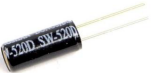](mediamedia/f2b0fe5c69eada37beef36022ae03974.png) | [](mediamedia/7ea5721963dbb796fde0e7c2f3e8e4b5.png) |
| Button\*4                                                    | Tilt Switch\*1                                               | Photoresistor\*2                                             |
| [](mediamedia/adb25a98a644070c6de378fe98017d8b.png) | [](mediamedia/27daf19fb8eec4de5733d41564d7d5f1.png) | [](mediamedia/b45bb81bb3763377c63accce606ac5f2.png) |
| Flame Sensor\*1                                              | IR Receiver\*1                                               | 10K Thermistor\*1                                            |
| [](mediamedia/e5756d5b6983fb93087e49a42482dcb8.png) | [](mediamedia/408f9f823aab6078768f08462eda209b.png) | [](mediamedia/c88b647385c69cfc1a6746a3c459ab12.png) |
| IC 74HC595N \*1                                              | ESP8266 Serial WiFi ESP-01\*1                                | 1-Digit Tube Display\*1                                      |
| [](mediamedia/30caea18cf2c7cc1f25849d1b0558570.png) | [](mediamedia/9cc290f5d877e6c3dbc1f5aaa084d3b7.png) | [](mediamedia/1177eaa9c6aaf4919919f2c5fe599957.png) |
| Temperature and Humidity Sensor\*1                           | Sound Sensor\*1                                              | PIR Motion Sensor\*1                                         |
| [](mediamedia/ab1e4dfd6931538b45fa24158863d155.png) | [](mediamedia/a2490df235918408342f93fbd9833147.png) | [](mediamedia/277ad05e0d79dc19d169b5ddc164346e.jpeg) |
| LM35 Temperature Sensor\*1                                   | Stepper Motor Driver Board\*1                                | Stepper Motor\*1                                             |
|  | [](mediamedia/5a31baa94e7595e5d2d5f97cee3dca57.png) |  |
| 4-Digit Tube Display\*1                                      | 8\*8 Dot Matrix Display \*1                                  | RFID Module\*1                                               |
|  |  | [](mediamedia/3ee0bde62a5c8da6f89777cd47240e6c.png) |
| LCD\_128X32\_DOT \*1                                         | Joystick Module\*1                                           | 5V Relay Module\*1                                           |
| [](mediamedia/4205659c5094b7fbd53b588e8d8eb4f7.jpeg) | [](mediamedia/84de4203eae3476a214645ddf08b3642.png) | [](mediamedia/d773d595c14e91ab031192e169335927.png) |
| Ultrasonic Sensor\*1                                         | 4\*4 Membrane Keypad\*1                                      | 130 DC Motor\*1                                              |
| [](mediamedia/1886ee7e1faeea2c093ae626e1b8baaf.png) |                                                              |                                                              |
| Servo\*1                                                     |                                                              |                                                              |

## 3. Keyestudio PLUS board

The Keyestudio PLUS motherboard, fully compatible with the Arduino IDE control board, which is the core of this kit

It incorporates all functions of Arduino UNO R3. Additionally, more improvements on the PLUS board makes it powerful.

It is your best choice to build up circuits and programme.


**Specifications:**

-   Microcontroller: ATMEGA328P-AU

-   USB to serial chip: CP2102

-   Working voltage: DC 5V or 3.3V (DIP switch control)

-   External power supply: DC 6V to 15V (9V is recommended.)

-   Digital I/O pins: 14 (D0 to D13)

-   PWM channel: 6 (D3 D5 D6 D9 D10 D11)

-   Analog input channel (ADC): 8 (A0 to A7)

-   Each I/O port of DC output capacity: 20 mA

-   Output capacity of 3.3V port: 50 mA

-   Flash Memory: 32 KB（of which the bootloader uses 0.5 KB）

-   SRAM: 2 KB (ATMEGA328P-AU)

-   EEPROM:1 KB (ATMEGA328P-AU)

-   Clock speed: 16MHz

-   On-board LED pin: D13


**Pinout**


**Specialized Functions of Pins:**

-   Serial communication interface: D0 is RX, D1 is TX

-   PWM interface (pulse width modulation): D3 D5 D6 D9 D10 D11

-   External interrupt interface: D2(interrupt 0) and D3 (interrupt 1)

-   SPI communication interface: D10 is SS, D11 is MOSI, D12 is MISO, D13 is SCK

-   IIC communication port: A4 is SDA, A5 is SCL

**Note: The all experiments of this learning kit, the DIP switch on the Keyestudio PLUS control board is turned to the 5V terminal by default.**

## 4.How to Download Arduino, Drivers and Library Files

### **1. Install Windows Drivers**


#### 1.1 Download and install Arduino software

Enter the Arduino official website: [https://www.arduino.cc/](https://www.arduino.cc/) and click "SOFTWARE" to enter the download page, as shown in the following figure.


Then, select and download the corresponding installer according to your operating system. If you are a Windows user, please select "Windows Installer" to download the correct installation driver.


Click **Windows Win7 and newer** to download the installer for Arduino 1.8.16, which needs to be installed manually. And when clicking on the **Windows ZIP file**, the zip file of the Arduino 1.8.16 will be downloaded directly, and you only need to unzip it to complete the installation.


Generally, you can download it by clicking **JUST DOWNLOAD**. Of course, if you like, you can choose a small sponsorship to help the great Arduino open source.

Once the Arduino software is downloaded, continue to install. When you receive **a warning from your operating system, allow the driver to install.** Click on **I Agree**, select the components you want to install and then click **Next**.


Select the installation directory (The default directory is recommended.), then click **Install**.


If the following interface appears, you should select **Install**.


This process will extract and install all the necessary files to properly execute the Arduino software (IDE).

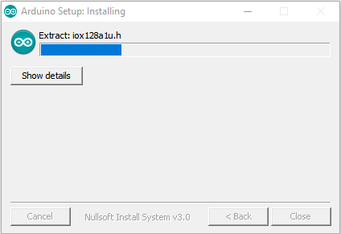

After the installation is complete, an Arduino software shortcut will be created on the desktop.


#### 1.2 Install the drivers on the Windows system

**(Note: If the computer has already installed the drivers, you do not need to install the drivers again. If not, you need to do the following.)**

Drivers must be installed before using the Plus mainboard, otherwise the Plus mainboard will not be able to communicate with the computer. Unlike the USB series chip (ATMEGA8U2) of the Arduino UNO R3, the Plus mainboard uses the USB series CP2102 chip and the USB type-C interface. The CP2102 chip driver is included in Arduino IDE 1.8.0 and higher. Usually, you connect the Plus mainboard to the computer via a USB cable, the computer will recognize the hardware, and the WINDOWS system will automatically install the CP2102 driver. After a while, the CP2102 driver will be installed successfully.

**Note:**

1).Please make sure your IDE is updated to version 1.8.0 or a later version.

2).If the version of the Arduino IDE you downloaded is lower than 1.8.0, please download the CP2102 driver and install it manually.


Link to download CP2102 driver: [**https://fs.keyestudio.com/CP2102-WIN**](https://fs.keyestudio.com/CP2102-WIN)

If the driver installation fails, you need to install the driver manually.Please open the device manager of your computer, right-click "Computer" -----“Properties”-----“Device Manager”. Under Ports (COM &LPT) or Other devices, the yellow exclamation mark means CP2102 driver installation failed.


It shows that the driver of CP2102 has not been installed successfully, there will be a yellow exclamation mark. Double-click  and then click“**Update drive...**”to update driver.

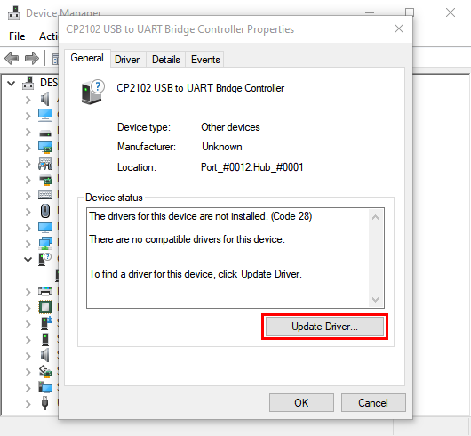

Click “**Browse my computer for drivers**”to find the Arduino software we installed or downloaded.


There is a drives folder in the Arduino folder（)，open the drivers folder and you can see the drivers of CP210X series chips.

Click on“**Browse...**”, select the drivers of CP210X series chips and click“**Next**”.


After a while, the drivers are installed successfully.


Open the device manager, we will find the yellow exclamation mark disappeared. The driver of CP2102 is installed successfully.

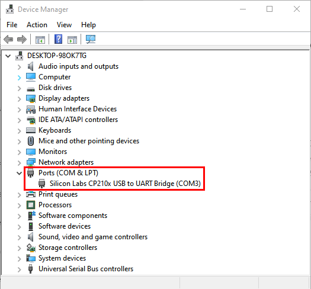

#### 1.3 Arduino IDE setting

Once the driver is successfully installed, the next step is to configure the Arduino IDE devices and ports. For the PLUS motherboard, click **Tools**→**Board** and select **Arduino Uno** (as shown in the figure below).


Then select the correct COM port. After the driver is successfully installed, you can see the corresponding COM port.


Click on **Tools**→**Port→COM3**


Before uploading the code program to the control board, let’s demonstrate the functions of each symbol in the Arduino IDE toolbar.


A - Used to verify whether there is any compiling mistakes or not.

B - Used to upload the program to your Arduino control board.

C - Used to create shortcut of a new sketch.

D - Used to directly open an example sketch.

E - Used to save the sketches.

F - Used to receive serial data from the board and send the serial data to the board's serial monitor.

#### 1.4 Start first program

Open“**File**”to select“**Examples**”, and choose“**Blink**”from“**Basics**”，as shown below.


When the sketch (Blink) window opens, you can see the entire program in the window.


Set the board type and COM port, the corresponding board types and COM ports are shown in the lower right corner of the IDE.


Click  to start compiling the program and check errors.


Click  to upload the program. After a few seconds, uploaded successfully.


The uploading is done. Using USB cable to power on, the on-board LEDs on the PLUS motherboard light up for 1 second and go off for 1 second, and the cycle continues. Congratulation, you finish the first program.

### **2\. Install the Drivers on the MAC System**


#### 2.1 Download and install Arduino software


#### 2.2 Download the drivers of CP2102

Link:[https://wiki.keyestudio.com/How\_to\_Install\_the\_Driver\_of\_CP2102\_on\_MAC\_System](https://wiki.keyestudio.com/How_to_Install_the_Driver_of_CP2102_on_MAC_System)

#### **2.3 How to install the driver of CP2102**

**(Note: If the driver is already installed, just skip the following instruction)**

Connect the PLUS mainboard to your MacOS computer with a USB cable, and open the Arduino IDE.


Click **Tools**→**Board:Arduino Uno** and **/dev/cu.usbserial-0001**.


Click to upload the code. If the upload is successful, as shown in the figure below, it will show that the upload is successful.


**Note: If the code program is uploaded successfully, you do not need to install the driver again, you can skip the following steps to install the driver. If not, you need to follow the steps below to install the CP2102 driver. Execute the following steps (2) to (13).**

CP2102 drivers download link: [https://www.silabs.com/products/development-tools/software/usb-to-uart-bridge-vcp-drivers](https://www.silabs.com/products/development-tools/software/usb-to-uart-bridge-vcp-drivers)

Click to download the MacOS version.


Unzip the downloaded package.


 Open the folder and double-click“**SiLabsUSBDriverDisk.dmg**”file.


You can see the following files.


Double-click\*\*“Install CP210x VCP Driver”,\*\* tick“**Don’t warn me when opening application on this disk image**”and click“**Open**”.


Click“**Continue**”.


(7).Click on“**Agree**”and select“**Continue**”.


 Continue to click“**Continue**”, then enter your user password.


 Select“**Select Open Security Preferences**”.


 Click the security lock and enter your user password to authorize it.


When you see that the lock is opened, click“**Allow**”.


 Go back to the installation interface and wait for the installation according to the prompts.


 Install successfully.


Open arduinoIDE, click ”**Tools**”to choose the Arduino Uno as the main board, and“**/dev/cu.SLAB\_USBtoUAPT**”as the serial port.


 Then click  to upload the program, you can see that the program is successfully burned.


### **3\. Install Library Files to Arduino**

#### What are Libraries ?

Libraries are a collection of code that makes it easy for you to connect to a sensor, display, module, etc. For example, the built-in LiquidCrystal library help to talk to LCD displays. There are hundreds of additional libraries available on the Internet for download. Please refer to this website ([https://www.arduino.cc/en/Reference/Libraries](https://www.arduino.cc/en/Reference/Libraries)). The built-in libraries and some of the additional libraries are listed in.

#### How to Install a Library ?

**Manual installation**

(Windows system is taken as an example, MacOS can be used as a reference.)

When you want to add a library manually, you first have to exit the Arduino application, then you need to download the library as a ZIP file, decompress it and put it in the appropriate directory.

As an example, to download and install the IR Remote library, we go to the link: [https://github.com/shirriff/Arduino-IRremote](https://github.com/shirriff/Arduino-IRremote). Find the IR Remote library on GitHub. Download the IR Remote ZIP library by clicking the green “Code” button and then click “download ZIP”.


After downloading, unzip the IR remote library file package.

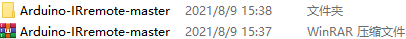

Then move the IR remote library file package to the Arduino folder.


Open the libraries folder in the Arduino folder and drag the Arduino- irremote -master folder into the Libraries folder.


In this way, the manual installation of the library file is completed.

Note: use the library files we provide, save you the trouble of downloading them.

Using the library files we provide, unzip each library file in turn, then copy and paste them into the libraries folder in the Arduino folder.


e.g. Take  as an example. Click  to decompress it. Copy and paste the decompressed file package  into the libraries folder in the Arduino folder.


By analogy, use the above method to decompress the remaining library files, then copy and paste them into the libraries folder in the Arduino folder.


In this way, the library files are manually added.

## 5.Projects

### **Project 1: Hello World**

#### 1.**Introduction**

For Arduino beginners, we will start with some simple things. In this project, you only need a PLUS mainboard and a USB cable to complete the "Hello World!" project.

#### 2.**Components Required**

|  | [](mediamedia/755ba492c38e44d91e8b2c120dc64904.png) |
| ------------------------------------------------------------ | ------------------------------------------------------------ |
| Keyestudio PLUS Mainboard\*1                                 | USB Cable\*1                                                 |

#### 3.**Connection**


Arduino uses a serial monitor to display information such as print statements and sensor data. This is a very powerful tool for debugging long code. Let's first learn the“if”statement, which is a control structure in Arduino programming.

```c
/*
Keyestudio 2021 Starter Kit
Project 1
Hello World
http//www.keyestudio.com
*/
char val;// defines variable "val"
void setup()
{
Serial.begin(9600);// sets baudrate to 600
}
void loop()
{
  if (Serial.available() > 0) {
    val=Serial.read();// reads symbols assigns to "val"
    if(val=='R')// checks input for the letter "R"
    {  // if so,    
     Serial.println("Hello World!");// shows “Hello World !”.
    }
  }
}
```

#### 5.**Result**

Select the correct Arduino IDE mainboard type and COM port, and click the **button** on the Arduino IDE to upload the code. After successfully uploading, click the icon  to enter the serial display.


Whenever you enter an "R" in the text box and click "Send", the serial monitor will display "Hello World!”.


### **Project 2: LED Blinking**

####   1.**Introduction**

In this project, we will show you the LED flashing effect through Arduino's digital pins.

#### 2.**Components Required**

|  |  |  |  |  |  |
| ------------------------------------------------------------ | ------------------------------------------------------------ | ------------------------------------------------------------ | ------------------------------------------------------------ | ------------------------------------------------------------ | ------------------------------------------------------------ |
| Keyestudio Plus Mainboard*1                                  | Red LED*1                                                    | 220Ω Resistor*1                                              | Breadboard*1                                                 | Jumper Wire*2                                                | USB Cable*1                                                  |

#### 3.**Component Knowledge**

**LED:**


It is a kind of semiconductor called "light-emitting diode", which is an electronic device made of semiconductor materials (silicon, selenium, germanium, etc.). It has an anode and a cathode. The short lead (cathode) is grounded. The long lead (anode) is connected to 5V.


 **Resistor**

A resistor is an electronic component in a circuit that restricts or regulates the flow current flow. Its unit is(Ω). 1 mΩ= 1000 kΩ，1kΩ= 1000Ω.

 

We can use resistors to protect sensitive components, such as LEDs. The strength of the resistance is marked on the body of the resistor with an electronic color code. Each color code represents a number, and you can refer to it in a resistance card.


In this kit, we provide eight 5-band resistors with different resistance values. Take three 5-band resistors as an example.

220Ω resistor*10


10KΩ resistor*10


1KΩ resistor*10


The connection between current, voltage, and resistance can be expressed by the formula: I=U/R.In the figure below, if the voltage is 3V, the current through R1 is: I = U / R = 3 V / 10 KΩ= 0.0003A= 0.3mA.


**Breadboard**

A breadboard is used to build and test circuits quickly before finalizing any circuit design. The breadboard has many holes into which circuit components like integrated circuits and resistors can be inserted. A typical breadboard is as follows.


The bread board has strips of metal which run underneath the board and connect the holes on the top of the board. The metal strips are laid out as shown below. Note that the top and bottom rows of holes are connected horizontally while the remaining holes are connected vertically.


The first two rows (top) and the last two rows (bottom) of the breadboard are used for the positive (+) and negative (-) terminals of the power supply, respectively. The conductive layout of the breadboard is shown in the following diagram.


When we connect DIP (Dual In-line Packages) components, such as integrated circuits, microcontrollers, chips and so on, we can see that a groove in the middle isolates the middle part, so the top and bottom of the groove is not connected. DIP components can be connected as shown in the figure below.


#### **4.Circuit Diagram and Wiring Diagram**

As shown in the diagram, we use digital pin 10 and connect one LED to a 220 ohm resistor to avoid high current to damage the LED.

**Circuit Diagram:**


**Wiring Diagram:**

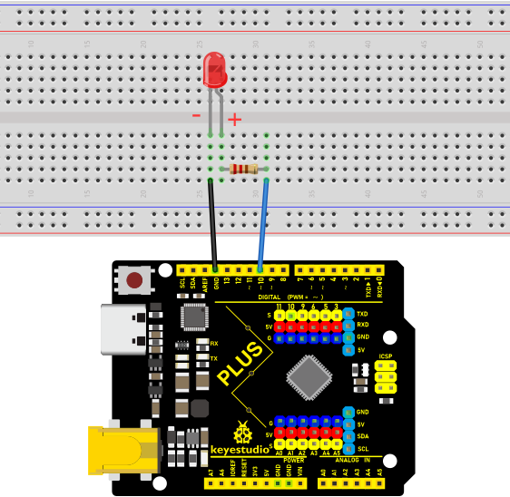


Note: How to connect an LED


How to identify the 220Ω five-band resistor

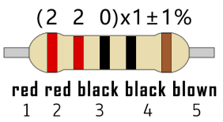

####   **5.Code**

```c
/*
Keyestudio 2021 Starter Kit
Project 2
LED_Blinking 
http//www.keyestudio.com
*/
int ledPin = 10; // defines numeric pin 10.
void setup()
{
pinMode(ledPin, OUTPUT);// defines PIN with connected LED as output
}
void loop()
{
digitalWrite(ledPin, HIGH); // turn on LED
delay(1000); // wait a second.
digitalWrite(ledPin, LOW); // turn off LED
delay(1000); // wait a second
}
```

####   **6.Result**

Upload the project code, wire up components according to the wiring diagram, and power on. The LED will blink.

####   **7.Explanation**

**pinMode(ledPin，OUTPUT)**: Before using the Arduino's pins, you need to tell the control board whether it is INPUT or OUTPUT. We use a built-in function “pinMode()” to do this.

**digitalWrite(ledPin，HIGH)** : When using a pin as an OUTPUT, it can be commanded as HIGH (output 5V) or LOW (output 0V).

### **Project 3: Breathing Led**

####   **1.Introduction**

In this project, we will learn the PWM control of ARDUINO. PWM is Pulse Width Modulation, which is a technique that encodes analog signal levels into digital signal levels. We will use PWM to control the brightness of LED.

####   **2.Components Required**

|  |  |  |  |  |  |
| ---------------------------------------------------------- | ---------------------------------------------------------- | ---------------------------------------------------------- | ----------------------------------------------------------- | ----------------------------------------------------------- | ------------------------------------------------------------ |
| Keyestudio Plus Mainboard*1                                | Red LED*1                                                  | 220Ω Resistor*1                                            | Breadboard*1                                                | Jumper Wire*2                                               | USB Cable*1                                                  |

####   **3.Component Knowledge**


**Working principle:** 

It can control the brightness of LED, the speed of DC motors and Servo motors, and outputs square wave signal. If we want to dim the LED, we can change the ON(open) and OFF(close) time of the signal. When we change the time of ON and OFF fast enough, then the brightness of the LED will change. Here are some terms related to PWM as follows.

ON (open)：When the signal is high.

OFF (close)：When the signal is low.

Period: It is the sum of the time of On and Off.

Duty cycle: The percentage of time when the signal is at a high level for a certain period of time. At 50% duty cycle and 1Hz frequency, the LED will be on for half a second and off for the other half of a second.


**Arduino and PWM**

The Arduino IDE has a built-in function “analogWrite()” that can be used to generate PWM signals. Most of the pins generate signals with a frequency of about 490Hz and we can use this function to give values from 0 to 255.

“analogWrite(0)” indicates a signal with 0% duty cycle. 

“analogWrite(127)” indicates a signal with 50% duty cycle. 

“analogWrite(255)” indicates a signal with 100% duty cycle. 

On the Plus control board, the PWM pins are 3, 5, 6, 9, 10, and 11. PWM pins are marked with the “~”symbol. In this project, you will learn how to get the PWM output from the digital pins of the Plus control board and control the brightness of the LED by code.

#### **4. Circuit Diagram and Wiring Diagram**


**Note:**

How to connect the LED


How to identify the 220Ω 5-band resistor


#### **5. Code**

```c
/*
Keyestudio 2021 Starter Kit
Project 3
Breathing_Led
http//www.keyestudio.com
*/
int ledPin = 6;
 void setup() 
{
  pinMode(ledPin,OUTPUT);
}
void loop(){
  for (int value = 0 ; value < 255; value=value+1){
    analogWrite(ledPin, value);
    delay(5);
  }
  for (int value = 255; value >0; value=value-1){
    analogWrite(ledPin, value);
    delay(5);
  } 
}      
```

####   **6.Result**

After burning the project code, connecting the wires according to the wiring diagram, and powering on, the LED lights up gradually, and then gradually darkens.

####   **7.Explanation**

When we need to execute a sentence repeatedly, we can use the “for” statement.

The “for”statement format is as follows:


The loop sequence of“for”statement is as follows:

Round 1: 1 → 2 → 3 → 4

Round 2: 2 → 3 → 4

…

Until 2 does not hold and the “for” statement loop ends.

Knowing this sequence, go back to the code.

**for (int value = 0; value < 255; value=value+1){**

**...}**

**for (int value = 255; value >0; value=value-1){**

**...}**

These two for statements, which realize that the value can continuously increases from 0 to 255, then decreases from 255 to 0. The loop continues indefinitely.

In the “for”statement, involving a new function “analogWrite()”.

We know that the digital port has only two states, 0 and 1. How to send an analog value to a digital pin? This function will be used. Take a look at the Arduino board and look at the digital pins. You will find that 6 of the pins are marked with "~". These pins are different from other pins in that they can output PWM signals.

The format as follow:

**analogWrite(pin,value)**

The “analogWrite()” function is used to input an analog value from 0 to 255 to the PWM port. Therefore, the value is between 0 and 255. Note that the “analogWrite()” function can only write to the digital pins with PWM function, that is, the 3, 5, 6, 9, 10, and 11 pins.

### **Project 4: Traffic Light**

####   **1.Introduction**

Traffic lights are closely related to people's daily lives. Traffic lights generally show red, yellow, and green. Everyone should obey the traffic rules, which can avoid many traffic accidents. In this project, we will use a PLUS board and some LEDs (red, green and yellow) to simulate the traffic lights.

####   **2.Components Required**

|                    |  |  |  |
| ------------------------------------------------------------ | ------------------------------------------------------------ | ------------------------------------------------------------ | ------------------------------------------------------------ |
| Keyestudio Plus Mainboard*1                                  | Red LED*1                                                    | Yellow LED*1                                                 | Green LED*1                                                  |
|  |  |    |    |
| USB Cable*1                                                  | 220Ω Resistor*3                                              | Breadboard*1                                                 | Jumper Wires                                                 |

####   **3.Circuit Diagram and Wiring Diagram**


Note:

How to connect an LED


How to identify the 220Ω 5-band resistor


####   **4.Code**

The flashing time of each LED should be the same as the traffic lights. In this program, we use “Arduino delay ()” to control the delay time.

```c
/*
Keyestudio 2021 Starter Kit
Project 4
Traffic_Light
http//www.keyestudio.com
*/
int redled =10; // initializes digital PIN 10
int yellowled =7; // initializes digital PIN 7
int greenled =4; // initializes digital PIN 4
void setup()
{
pinMode(redled, OUTPUT);// sets digital PIN 10 to “output”
pinMode(yellowled, OUTPUT); // sets digital PIN 7 to “output”
pinMode(greenled, OUTPUT); // sets digital PIN 4 to “output”
}
void loop()
{
digitalWrite(greenled, HIGH);// turns on LED
delay(5000);// delays 5 seconds
digitalWrite(greenled, LOW); // turns off LED
for(int i=0;i<3;i++)// flashes 3 times.
{
delay(500);// delays 0.5 second
digitalWrite(yellowled, HIGH);// turns on LED
delay(500);// delays 0.5 second
digitalWrite(yellowled, LOW);// turns off LED
} 
delay(500);// delays 0.5 second
digitalWrite(redled, HIGH);// turns on LED
delay(5000);// delays 5 second
digitalWrite(redled, LOW);// turns off LED
}
```

####   **5.Result**

Upload the code and power on, the green LED will light up for 5s then go off. Next, the yellow one will blink for 3 times and red LED will be on for 5s then go off.

### **Project 5: RGB LED**

#### **1.Introduction**


In this project, we will introduce the RGB LED and show you how to use the Plus control board to control the RGB LED. Even though RGB LED is very basic, it is also a great way to learn the fundamentals of electronics and coding.

#### **2.Components Required**

|  |  |  |  |  |  |
| ---------------------------------------- | ---------------------------------------------------------- | ---------------------------------------------------------- | ----------------------------------------------------------- | ----------------------------------------------------------- | ----------------------------------------------------------- |
| Keyestudio Plus Mainboard*1              | RGB LED*1                                                  | 220Ω Resistor*3                                            | Breadboard*1                                                | Jumper Wires                                                | USB Cable*1                                                 |

#### **3.Component Knowledge**

**RGB LED：**


The monitors mostly adopt the RGB color standard, and all the colors on the computer screen are composed of the three colors of red, green and blue mixed in different proportions.


This RGB LED has pin R, G and B and a common cathode. To change its brightness, we can use the PWM pins which can give different duty cycle signals to the RGB LED to produce different colors.

#### **4.Circuit Diagram and Wiring Diagram**

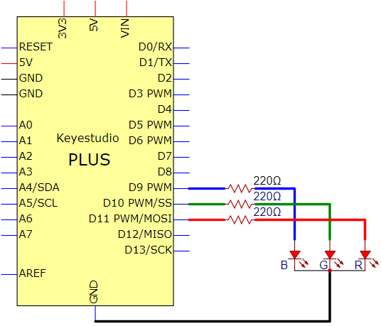

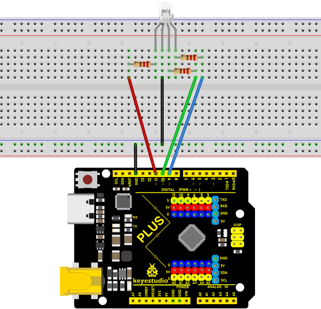

**Note:**

RGB LED longest pin (common cathode) connected to GND.


How to identify the 220Ω 5-band resistor

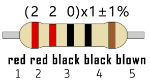

#### **5.Code**

```c
/*
Keyestudio 2021 starter learning kit
Project 5
RGB LED
http//www.keyestudio.com
*/
int redpin = 11; // select the pin for the red LED
int bluepin =9; // select the pin for the blue LED
int greenpin =10;// select the pin for the green LED
int val;
void setup() {
  pinMode(redpin, OUTPUT);
  pinMode(bluepin, OUTPUT);
  pinMode(greenpin, OUTPUT);
}
void loop() 
{
for(val=255; val>0; val--)
  {
   analogWrite(11, val);
   analogWrite(10, 255-val);
   analogWrite(9, 128-val);
   delay(1); 
  }
for(val=0; val<255; val++)
  {
   analogWrite(11, val);
   analogWrite(10, 255-val);
   analogWrite(9, 128-val);
   delay(1); 
  }
}
```

#### **6.Result**

Upload the project code, wire up, power up and wait a few seconds, you will see a colorful LED.

### **Project 6: Flowing Light**

#### **1.Introduction**

In our daily life, we can see many billboards made up of different colors of LED. They constantly change the light to attract the attention of customers. In this project, we will use Plus control board with 5 LEDs to achieve the effect of flowing water.

#### **2.Components Required**

|  |  |  |  |  |  |
| ----------------------------------------------------------- | ----------------------------------------------------------- | ----------------------------------------------------------- | ----------------------------------------------------------- | ----------------------------------------------------------- | ----------------------------------------------------------- |
| Keyestudio Plus Mainboard*1                                 | Red LED*5                                                   | 220Ω Resistor*5                                             | Breadboard*1                                                | JumperWires                                                 | USB Cable*1                                                 |

#### **3.Circuit Diagram and Wiring Diagram**


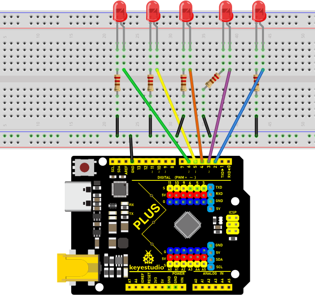

**Note:**

How to connect the LED


How to identify the 220Ω 5-band resistor


#### **4.Code**

```c
/*
Keyestudio 2021 Starter Kit 
Project 6
Flowing_Light
http//www.keyestudio.com
*/
int BASE = 2 ;// I/O PIN for the first LED
int NUM = 5; // amount of LEDs
void setup()
{
   for (int i = BASE; i < BASE + NUM; i ++) 
   {
     pinMode(i, OUTPUT);   // sets I/O PIN to "output"
   }
}
void loop()
{
   for (int i = BASE; i < BASE + NUM; i ++) 
   {
     digitalWrite(i, LOW); //sets I/O PIN to "low", turns off LEDs one after the other 
     delay(200); // delay
   }
   for (int i = BASE; i < BASE + NUM; i ++) 
   {
     digitalWrite(i, HIGH);   // sets I/O PIN to "high", turns on LEDs one after the other
     delay(200);  // delay
   }  
}
```

#### **5.Result**

After burning the project code, connecting the wires and powering on, the 5 LEDs connected to the D2 to D6 pins of the development board will gradually light up and then gradually go off, just like a battery charge.

### **Project 7: Active Buzzer**

#### **1.Introduction**

Active buzzer is a sound making element, widely used on computers, printers, alarms, electronic toys, telephones, timers, etc. It has an inner vibration source. In this project, we will use a PLUS control board to control the active buzzer to buzz.

#### **2.Components Required**

|  |  |  |  |  |
| ----------------------------------------- | ----------------------------------------------------------- | ----------------------------------------------------------- | ----------------------------------------------------------- | ----------------------------------------------------------- |
| Keyestudio Plus Mainboard*1               | Active Buzzer*1                                             | Breadboard *1                                               | Jumper Wires                                                | USB Cable*1                                                 |

#### **3. Component Knowledge**

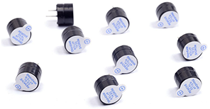

The active buzzer inside has a simple oscillator circuit which can convert constant direct current into a certain frequency pulse signal. Once active buzzer receives a high level, it will sound. The passive buzzer is an integrated electronic buzzer with no internal vibration source. It must be driven by 2K to 5K square wave instead of a DC signal. The appearance of the two buzzers is very similar, but passive buzzers come with a green circuit board, and active buzzers come with a black tape. Passive buzzers don't have positive pole, but active buzzers have.

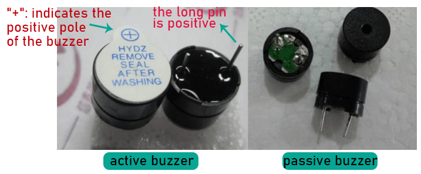


Note: The positive terminal ("+"/long pin) of the active buzzer is connected to pin 8, and the negative terminal (short pin) is connected to GND.

#### **5.Code**

```c
/*
Keyestudio 2021 Starter Kit
Project 7
Active_buzzer 
http//www.keyestudio.com
*/
int buzzerPin = 8;
void setup ()
{
  pinMode (buzzerPin, OUTPUT);
}
void loop ()
{
  digitalWrite (buzzerPin, HIGH);
  delay (500);
  digitalWrite (buzzerPin, LOW);
  delay (500);
}
```

#### **6.Result**

Upload the project code, wire up and power up, then the active buzzer buzzes.

### **Project 8: Passive Buzzer**

####   **1.Introduction**

In this project, we will learn the passive buzzer and use the Plus control board to control the passive buzzer to play a song. Unlike an active buzzer, a passive buzzer can emit sounds of different frequencies.

####   **2.Components Required**

| [](mediamedia/ca7cf6e6d64e942d8c7a101a023e44fc.jpeg) |  | [](mediamedia/e380dd26e4825be9a768973802a55fe6.png) | [](mediamedia/e9a8d050105397bb183512fb4ffdd2f6.png) | [](mediamedia/755ba492c38e44d91e8b2c120dc64904.png) |
| ------------------------------------------------------------ | ------------------------------------------------------------ | ------------------------------------------------------------ | ------------------------------------------------------------ | ------------------------------------------------------------ |
| Keyestudio Plus Mainboard*1                                  | Passive Buzzer*1                                             | Breadboard*1                                                 | Jumper Wires                                                 | USB Cable*1                                                  |

#### **3\. Component Knowledge**


A passive buzzer is an integrated electronic buzzer with no internal vibration source. It must be driven by 2K to 5K square wave, not a DC signal. The two buzzers are very similar in appearance, but one buzzer with a green circuit board is a passive buzzer, while the other with black tape is an active buzzer. Passive buzzers cannot distinguish between positive polarity while active buzzers can.


#### **4\. Circuit Diagram and Wiring Diagram**


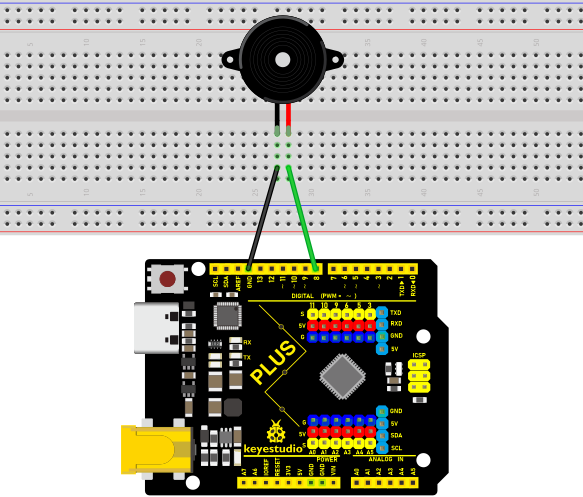

#### **5.Code**

```c
/*
Keyestudio 2021 Starter Kit
Project 8
Passive_buzzer
http//www.keyestudio.com
*/
#define NOTE_B0  31
#define NOTE_C1  33
#define NOTE_CS1 35
#define NOTE_D1  37
#define NOTE_DS1 39
#define NOTE_E1  41
#define NOTE_F1  44
#define NOTE_FS1 46
#define NOTE_G1  49
#define NOTE_GS1 52
#define NOTE_A1  55
#define NOTE_AS1 58
#define NOTE_B1  62
#define NOTE_C2  65
#define NOTE_CS2 69
#define NOTE_D2  73
#define NOTE_DS2 78
#define NOTE_E2  82
#define NOTE_F2  87
#define NOTE_FS2 93
#define NOTE_G2  98
#define NOTE_GS2 104
#define NOTE_A2  110
#define NOTE_AS2 117
#define NOTE_B2  123
#define NOTE_C3  131
#define NOTE_CS3 139
#define NOTE_D3  147
#define NOTE_DS3 156
#define NOTE_E3  165
#define NOTE_F3  175
#define NOTE_FS3 185
#define NOTE_G3  196
#define NOTE_GS3 208
#define NOTE_A3  220
#define NOTE_AS3 233
#define NOTE_B3  247
#define NOTE_C4  262
#define NOTE_CS4 277
#define NOTE_D4  294
#define NOTE_DS4 311
#define NOTE_E4  330
#define NOTE_F4  349
#define NOTE_FS4 370
#define NOTE_G4  392
#define NOTE_GS4 415
#define NOTE_A4  440
#define NOTE_AS4 466
#define NOTE_B4  494
#define NOTE_C5  523
#define NOTE_CS5 554
#define NOTE_D5  587
#define NOTE_DS5 622
#define NOTE_E5  659
#define NOTE_F5  698
#define NOTE_FS5 740
#define NOTE_G5  784
#define NOTE_GS5 831
#define NOTE_A5  880
#define NOTE_AS5 932
#define NOTE_B5  988
#define NOTE_C6  1047
#define NOTE_CS6 1109
#define NOTE_D6  1175
#define NOTE_DS6 1245
#define NOTE_E6  1319
#define NOTE_F6  1397
#define NOTE_FS6 1480
#define NOTE_G6  1568
#define NOTE_GS6 1661
#define NOTE_A6  1760
#define NOTE_AS6 1865
#define NOTE_B6  1976
#define NOTE_C7  2093
#define NOTE_CS7 2217
#define NOTE_D7  2349
#define NOTE_DS7 2489
#define NOTE_E7  2637
#define NOTE_F7  2794
#define NOTE_FS7 2960
#define NOTE_G7  3136
#define NOTE_GS7 3322
#define NOTE_A7  3520
#define NOTE_AS7 3729
#define NOTE_B7  3951
#define NOTE_C8  4186
#define NOTE_CS8 4435
#define NOTE_D8  4699
#define NOTE_DS8 4978
#define REST 0
int tempo=114; // change this to make the song slower or faster
int buzzer = 8;// initializes  digital I/O PIN to control the buzzer
// notes of the moledy followed by the duration
// a 4 means a quarter note, 8 an eighteenth , 16 sixteenth, so on
//  !!negative numbers are used to represent dotted notes
//  so -4 means a dotted quarter note, that is, a quarter plus an eighteenth
int melody[] = {
  NOTE_E4,4,  NOTE_E4,4,  NOTE_F4,4,  NOTE_G4,4,//1
  NOTE_G4,4,  NOTE_F4,4,  NOTE_E4,4,  NOTE_D4,4,
  NOTE_C4,4,  NOTE_C4,4,  NOTE_D4,4,  NOTE_E4,4,
  NOTE_E4,-4, NOTE_D4,8,  NOTE_D4,2,
  NOTE_E4,4,  NOTE_E4,4,  NOTE_F4,4,  NOTE_G4,4,//4
  NOTE_G4,4,  NOTE_F4,4,  NOTE_E4,4,  NOTE_D4,4,
  NOTE_C4,4,  NOTE_C4,4,  NOTE_D4,4,  NOTE_E4,4,
  NOTE_D4,-4,  NOTE_C4,8,  NOTE_C4,2,
  NOTE_D4,4,  NOTE_D4,4,  NOTE_E4,4,  NOTE_C4,4,//8
  NOTE_D4,4,  NOTE_E4,8,  NOTE_F4,8,  NOTE_E4,4, NOTE_C4,4,
  NOTE_D4,4,  NOTE_E4,8,  NOTE_F4,8,  NOTE_E4,4, NOTE_D4,4,
  NOTE_C4,4,  NOTE_D4,4,  NOTE_G3,2,
  NOTE_E4,4,  NOTE_E4,4,  NOTE_F4,4,  NOTE_G4,4,//12
  NOTE_G4,4,  NOTE_F4,4,  NOTE_E4,4,  NOTE_D4,4,
  NOTE_C4,4,  NOTE_C4,4,  NOTE_D4,4,  NOTE_E4,4,
  NOTE_D4,-4,  NOTE_C4,8,  NOTE_C4,2
};
// sizeof gives the number of bytes, each int value is composed of two bytes (16 bits)
// there are two values per note (pitch and duration), so for each note there are four bytes
int notes=sizeof(melody)/sizeof(melody[0])/2; 
// this calculates the duration of a whole note in ms (60s/tempo)*4 beats
int wholenote = (60000 * 4) / tempo;
int divider = 0, noteDuration = 0;
void setup() {
  // iterate over the notes of the melody
  // remember, the array is twice the number of notes (notes + durations)
  for (int thisNote = 0; thisNote < notes * 2; thisNote = thisNote + 2) {
    // calculates the duration of each note
    divider = melody[thisNote + 1];
    if (divider > 0) {
    noteDuration = (wholenote) / divider; // regular note, just proceed
    } else if (divider < 0) {
      // dotted notes are represented with negative durations!!
      noteDuration = (wholenote) / abs(divider);
      noteDuration *= 1.5; // increases the duration in half for dotted notes
    }
    // we only play the note for 90% of the duration, leaving 10% as a pause
    tone(buzzer, melody[thisNote], noteDuration*0.9);
  // Wait for the specief duration before playing the next note
    delay(noteDuration);
    noTone(buzzer);  //  stop the waveform generation before the next note
  }
}
void loop() {
// if you want to repeat the song forever, 
// just paste the setup code here instead.
}
```

####  **6.Result**

Upload the project code, wire up and power on, then the passive buzzer will play a song.

### **Project 9: 74HC595N Controls 7 LEDs**

####   **1.Introduction**

For a PLUS mainboard, it has only 22 I/O ports, how do we light up a large number of LEDs? In this project, we will use 74HC595N to control 7 LEDs to save port resources.

####   **2.Components Required**

|  |  |  |  |  |  |  |
| ------------------------------------------------------------ | ------------------------------------------------------------ | ------------------------------------------------------------ | ------------------------------------------------------------ | ------------------------------------------------------------ | ------------------------------------------------------------ | ------------------------------------------------------------ |
| Keyestudio Plus Mainboard\*1                                 | Red LED\*7                                                   | 74HC595N Chip\*1                                             | 220Ω Resistor\*7                                             | Breadboard\*1                                                | Jumper Wires                                                 | USB Cable\*1                                                 |

####   **3.Component Knowledge**


**74HC595N Chip:** To put it simply, 74HC595N chip is a combination of 8-digit shifting register, memorizer and equipped with tri-state output.The shift register and the memorizer are synchronized to different clocks, and the data is input on the rising edge of the shift register clock SCK and goes into the memory register on the rising edge of the memory register clock RCK. If the two clocks are connected together, the shift register is always one pulse earlier than the storage register. The shift register has a serial shift input (SI) and a serial output (SQH) for cascading. The 8-bit shift register can be reset asynchronously (low-level reset), and the storage register has an 8-bit Three-state parallel bus output, when the output enable (OE) is enabled (active low), the storage register is output to the 74HC595N pin (bus).


**Pins**：


VCC and GND are used used for chip power supply, and the operating voltage is 5V.

####   **4.Circuit Diagram and Wiring Diagram**


Note: Pay attention to the direction in which the 74HC595N chip is inserted.

 


####   **5.Code**

```c
/*
Keyestudio 2021 Starter Kit
Project 9
74HC595N_control_7_LEDS
http//www.keyestudio.com
*/
int data = 4;// sets PIN 4 of the 74HC595 to datainput PIN SI
int clock = 6;//  sets PIN 6 of the 74HC595 to clock PIN SCK
int latch = 5;// sets PIN 5 of the 74HC595 to output latch RCK
int ledState = 0;
const int ON = HIGH;
const int OFF = LOW;
void setup()
{
pinMode(data, OUTPUT);
pinMode(clock, OUTPUT);
pinMode(latch, OUTPUT);
}
void loop()
{
for(int i = 0; i < 256; i++)
{
updateLEDs(i);
delay(500);
}
}
void updateLEDs(int value)
{
digitalWrite(latch, LOW);//
shiftOut(data, clock, MSBFIRST, ~value);// shift out highbyte
digitalWrite(latch, HIGH);// lock
}
```

####   **6.Result**

Upload project code, wire up and power on, then you can see the changes of 7 LEDs cyclically.

### **Project 10: 1-Digit Digital Tube**

####   **1.Introduction**

The seven-segment digital tube is an electronic display device that displays decimal numbers. It is widely used in digital clocks, electronic meters, basic calculators and other electronic devices that display digital information. The tubes are an alternative to more complex dot-matrix displays that are easy to use in both limited light conditions and strong sunlight. In this project, we will use the PLUS control board to control 1-digit digital tube to display numbers.

####   **2.Components Required**

|  |  |  |  |  |  |
| ----------------------------------------- | ----------------------------------------------------------- | ----------------------------------------------------------- | ----------------------------------------------------------- | ----------------------------------------------------------- | ----------------------------------------------------------- |
| Keyestudio Plus Mainboard*1               | 1-digit Digital Tube*1                                      | 220Ω Resistor*8                                             | Breadboard*1                                                | Jumper Wires                                                | USB Cable*1                                                 |

####   **3.Component Knowledge**


**Display principle:** the digital tube display is a semiconductor light-emitting device. Its basic unit is a light-emitting diode (LED). The digital tube display can be divided into 7-segment digital tube and 8-segment digital tube according to the number of segments. The 8-segment digital tube has one more LED unit than the 7-segment digital tube (used for decimal point display). Each segment of the 7-segment LED display is a separate LED. According to the connection mode of the LED unit, the digital tube can be divided into a common anode digital tube and a common cathode digital tube.

In the common cathode 7-segment digital tube, all the cathodes (or negative electrodes) of the segmented LEDs are connected together, so you should connect the common cathode to GND. To light up a segmented LED, you can set its associated pin to“HIGH”.

In the common anode 7-segment digital tube, the LED anodes (positive electrodes) of all segments are connected together, so you should connect the common anode to“+5V”. To light up a segmented LED, you can set its associated pin to “LOW”.


Each part of the digital tube is composed of an LED. So when you use it, you also need to use a current limiting resistor. Otherwise, the LED will be damaged. In this experiment, we use an ordinary common cathode one-bit digital tube. As we mentioned above, you should connect the common cathode to GND. To light up a segmented LED, you can set its associated pin to “HIGH”.

####   **4.Circuit Diagram and Wiring Diagram**

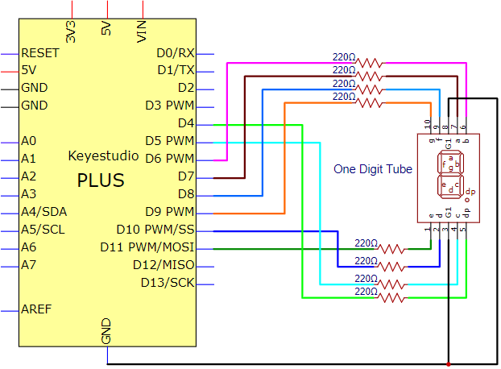

**Note:** The direction of the 7-segment digital tube inserted into the breadboard is the same as the wiring diagram, and there is one more point in the lower right corner.

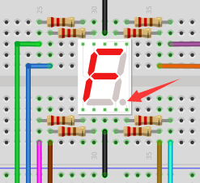

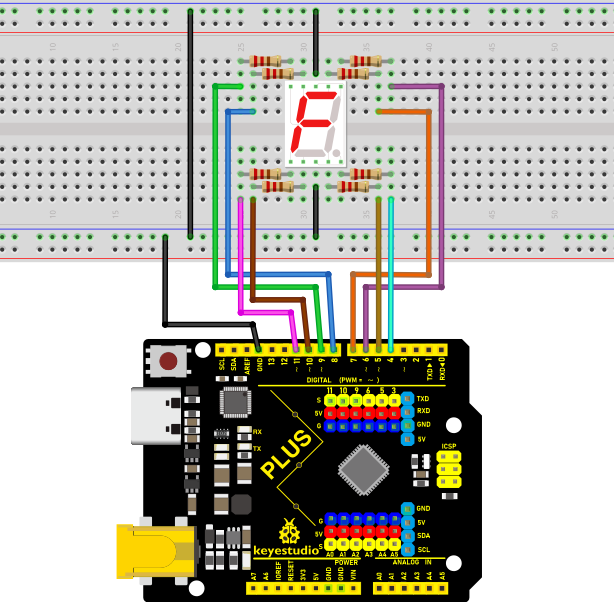

The digital display is divided into 7 segments, and the decimal point display is divided into 1 segment. When certain numbers are displayed, the corresponding segment will be illuminated. For example, when the number 1 is displayed, segments b and c will be opened. We compile a subroutine for each number, and compile the main program to display a number every 1 second, and display numbers 9 to 0 in cycles. The display time of each number depends on the delay time, the longer the delay time, the longer the display time.

```c
/*
Keyestudio 2021 Stater Kit
Project 10
1-digit Digital Tube
http//www.keyestudio.com
*/
// sets the IO PIN for every segment
int a = 7;            // digital PIN 7 for segment a
int b = 6;            // digital PIN 6 for segment b
int c = 5;            // digital PIN 5 for segment c
int d = 10;           //digital PIN 10 for segment d
int e = 11;           //digital PIN 11 for segment e
int f = 8;            //digital PIN 8 for segment f
int g = 9;            //digital PIN 9 for segment g
int dp = 4;           //digital PIN 4 for segment dp
void digital_0(void)  // displays number 0
{
  unsigned char j;
  digitalWrite(a, HIGH);
  digitalWrite(b, HIGH);
  digitalWrite(c, HIGH);
  digitalWrite(d, HIGH);
  digitalWrite(e, HIGH);
  digitalWrite(f, HIGH);
  digitalWrite(g, LOW);
  digitalWrite(dp, LOW);
}
void digital_1(void)  // displays number 1
{
  unsigned char j;
  digitalWrite(c, HIGH);     // led sets level for PIN 5 to "high", turns on segment c
  digitalWrite(b, HIGH);     // turns on segment b
  for (j = 7; j <= 11; j++)  // turns off other segments
    digitalWrite(j, LOW);
  digitalWrite(dp, LOW);  // turns off segment dp
}
void digital_2(void)  // displays number 2
{
  unsigned char j;
  digitalWrite(b, HIGH);
  digitalWrite(a, HIGH);
  for (j = 9; j <= 11; j++)
    digitalWrite(j, HIGH);
  digitalWrite(dp, LOW);
  digitalWrite(c, LOW);
  digitalWrite(f, LOW);
}
void digital_3(void)  // displays number 3
{
  digitalWrite(g, HIGH);
  digitalWrite(a, HIGH);
  digitalWrite(b, HIGH);
  digitalWrite(c, HIGH);
  digitalWrite(d, HIGH);
  digitalWrite(dp, LOW);
  digitalWrite(f, LOW);
  digitalWrite(e, LOW);
}
void digital_4(void)  // displays number 4
{
  digitalWrite(c, HIGH);
  digitalWrite(b, HIGH);
  digitalWrite(f, HIGH);
  digitalWrite(g, HIGH);
  digitalWrite(dp, LOW);
  digitalWrite(a, LOW);
  digitalWrite(e, LOW);
  digitalWrite(d, LOW);
}
void digital_5(void)  // displays number 5
{
  unsigned char j;
  digitalWrite(a, HIGH);
  digitalWrite(b, LOW);
  digitalWrite(c, HIGH);
  digitalWrite(d, HIGH);
  digitalWrite(e, LOW);
  digitalWrite(f, HIGH);
  digitalWrite(g, HIGH);
  digitalWrite(dp, LOW);
}
void digital_6(void)  // displays number 6
{
  unsigned char j;
  for (j = 7; j <= 11; j++)
    digitalWrite(j, HIGH);
  digitalWrite(c, HIGH);
  digitalWrite(dp, LOW);
  digitalWrite(b, LOW);
}
void digital_7(void)  // displays number 7
{
  unsigned char j;
  for (j = 5; j <= 7; j++)
    digitalWrite(j, HIGH);
  digitalWrite(dp, LOW);
  for (j = 8; j <= 11; j++)
    digitalWrite(j, LOW);
}
void digital_8(void)  // displays number 8
{
  unsigned char j;
  for (j = 5; j <= 11; j++)
    digitalWrite(j, HIGH);
  digitalWrite(dp, LOW);
}
void digital_9(void)  // displays number 9
{
  unsigned char j;
  digitalWrite(a, HIGH);
  digitalWrite(b, HIGH);
  digitalWrite(c, HIGH);
  digitalWrite(d, HIGH);
  digitalWrite(e, LOW);
  digitalWrite(f, HIGH);
  digitalWrite(g, HIGH);
  digitalWrite(dp, LOW);
}
void setup() {
  int i;  // declares a Variable
  for (i = 4; i <= 11; i++)
    pinMode(i, OUTPUT);  // sets PIN 4-11 to "output"
}
void loop() {
  while (1) {
    digital_9();  // displays number 9
    delay(1000);  // waits a sencond
    digital_8();  // displays number 8
    delay(1000);  // waits a sencond
    digital_7();  // displays number 7
    delay(1000);  // waits a sencond
    digital_6();  // displays number 6
    delay(1000);  // waits a sencond
    digital_5();  // displays number 5
    delay(1000);  // waits a sencond
    digital_4();  // displays number 4
    delay(1000);  // waits a sencond
    digital_3();  // displays number 3
    delay(1000);  // waits a sencond
    digital_2();  // displays number 2
    delay(1000);  // waits a sencond
    digital_1();  // displays number 1
    delay(1000);  // waits a sencond
    digital_0();  // displays number 0
    delay(1000);  // waits a sencond
  }
}
```

####   **6.Result**

After burning the project code, connecting the wires and powering on, 1-digit digital tube will display numbers from 9 to 0.

### **Project 11: 4-digit Digital Tube**

####   **1.Introduction**

The 4-digit 7-segment digital tube is a very practical display device, and it is used for devices such as electronic clocks and score counters. Due to the low price and it is easy to use, more and more projects will use 4-digit 7-segment digital tubes. In this project, we will use the PLUS control board to control a 4-bit 7-segment digital tube to create a manual counter.

####   **2.Components Required**

|  |  |  |  |
| ----------------------------------------- | ----------------------------------------------------------- | ----------------------------------------------------------- | ----------------------------------------------------------- |
| Keyestudio Plus Mainboard*1               | 4-Digit Digital Tube Module*1                               | F-F Dupont Wires                                            | USB Cable*1                                                 |

####   **3.Component Knowledge**


**TM1650 4-digit digital tube:** It is a 12-pin 4-digit tube display module with clock dots. The driver chip is TM1650 which only needs 2 signal lines to enable the microcontroller to control the 4-digit 8-segment digital tube. The control interface level can be 5V or 3.3V.

**Specifications of 4-bit digital tube module:**

Working voltage: DC 3.3V-5V

Maximum current: 100MA

Maximum power: 0.5W

**Schematic diagram of 4-digit digital tube module:**


####   **4.Wiring Diagram**


####   **5.Code**

**Note：** The library file needs to be installed in the code. If the **TM1650-master** library file has been added, ignore the process of adding the library file below.

Put the decompressed “**TM1650-master**” folder into “Arduino libraries” in the compiler installation directory.

Then you need to restart the compiler, otherwise the compilation will not work.

e.g：C: Program Files\Arduino\libraries

```c
/*
Keyestudio 2021 Starter Kit
Project 11
4-digit Digital Tube
http//www.keyestudio.com
*/
#include "TM1650.h"
#define CLK A5    //pins definitions for TM1650 and can be changed to other ports 
#define DIO A4
TM1650 DigitalTube(CLK,DIO);

void setup(){
  //DigitalTube.setBrightness();  //stes brightness from 0 to 7(default is 2)
  //DigitalTube.displayOnOFF();   // 0= off,1= on(default is 1)
  for(char b=1;b<5;b++){
    DigitalTube.clearBit(b);      //which bit to clear
  }
  DigitalTube.displayDot(1,true); // displays the first number
  DigitalTube.displayDot(2,true);
  DigitalTube.displayDot(3,true);
  DigitalTube.displayDot(4,true);
  DigitalTube.displayBit(3,0);    //which number to display. bit=1-4, number=0-9
}

void loop(){
  for(int num=0; num<10; num++){
    DigitalTube.displayBit(1,num);
    DigitalTube.displayBit(2,num);
    DigitalTube.displayBit(3,num);
    DigitalTube.displayBit(4,num);
    delay(1000);
  }
}
```

####   **6.Result**

Upload the project code, wire up and power on, 4-digit digital tube circularly displays numbers from 0000 to 9999.

### **Project 12: 8×8 Dot-matrix Display**

####   **1.Introduction**

The dot-matrix display is an electronic digital display device that can show information on machines, clocks and many other devices. In this project, we will use the PLUS mainboard to control the 8x8 LED dot matrix to make a“❤”pattern.

####   **2.Components Required**

|  |  |  |  |
| ----------------------------------------- | ----------------------------------------------------------- | ----------------------------------------------------------- | ----------------------------------------------------------- |
| Keyestudio Plus Mainboard*1               | 8*8 Dot-matrix Display *1                                   | F-F Dupont Wires                                            | USB Cable*1                                                 |

####   **3.Component Knowledge**


**8*8 Dot-matrix display module:**

The 8\*8 dot matrix is composed of 64 LEDs, and each LED is placed at the intersection of a row and a column. When using a single-chip microcomputer to drive an 8\*8 dot matrix, we need to use a total of 16 digital ports, which greatly wastes the data of the single-chip microcomputer. For this reason, we specially designed this module, using the HT16K33 chip to drive an 8\*8 dot matrix, and only need to use the I2C communication port of the single-chip microcomputer to control the dot matrix, which greatly saves the microcontroller resources.

**Specifications:**

- Working voltage: DC 5V

- Current: 200MA

- Maximum power: 1W


**Schematic diagram:**


####   **4.Wiring Diagram**


####   **5.Code**

Note: The library file needs to be installed in the code. If the “**Matrix**” library file has been added, ignore the process of adding the library file below.

Put the decompressed “**Matrix**” folder into “Arduino libraries” under the compiler installation directory.

After successful placement, you need to restart the compiler, otherwise the compilation will not work.

e.g：C:\Program Files\Arduino\libraries

```c
/*
Keyestudio 2021 starter learning kit
Project 12
12_8_8_Matrix
http//www.keyestudio.com
*/
#include <Matrix.h>
Matrix myMatrix(A4,A5);
uint8_t LedArray1[8]={0x00,0x18,0x24,0x42,0x81,0x99,0x66,0x00};
uint8_t  LEDArray[8];
void setup(){
myMatrix.begin(0x70);
}

void loop(){
  myMatrix.clear();
  for(int i=0; i<8; i++)
  {
    LEDArray[i]=LedArray1[i];
    for(int j=7; j>=0; j--)
    {
      if((LEDArray[i]&0x01)>0)
      myMatrix.drawPixel(j, i,1);
      LEDArray[i] = LEDArray[i]>>1;
    }
  }
  myMatrix.writeDisplay();
}
```

####   **6.Result**

After burning the test code, connecting the wires and powering on, 8*8 dot-matrix screen displays a "❤" pattern.

####   **7.Setup**

Set the display image

The display pattern can be set with the following code:

uint8_t LedArray1[8]={0x00,0x18,0x24,0x42,0x81,0x99,0x66,0x00};

Place the dot matrix horizontally

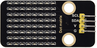

Convert 0x00,0x18,0x24,0x42,0x81,0x99,0x66,0x00 to binary numbers

0x00 is 0 0 0 0 0 0 0 0

0x18 is 0 0 0 1 1 0 0 0

0x24 is 0 0 1 0 0 1 0 0

0x42 is 0 1 0 0 0 0 1 0

0x81 is 1 0 0 0 0 0 0 1

0x99 is 1 0 0 1 1 0 0 1

0x66 is 0 1 1 0 0 1 1 0

0x00 is 0 0 0 0 0 0 0 0

The first hexadecimal data represents the control of the first column of LEDs, and the second data represents the control of the second column of LEDs and so on.

The setting method is to convert to a binary 8-bit value. “0” means that the LED is off, and “1” means that the LED is on. The first converted value is to control the first line of LEDs on and off, and so on.

 [](mediamedia/3ba4bb34ddf3ef182c5aa5bc7a309605.png)

### **Project 13: A Desk Lamp**

####   **1.Introduction**

Did you know that Arduino can light up an LED when you press a button? In this project, we will use the Plus Mainboard, a key switch and an LED to make a small desk lamp.

####   **2.Components Required**

|                    |  |  |  |  |
| ----------------------------------------------------------- | ----------------------------------------------------------- | ----------------------------------------------------------- | ----------------------------------------------------------- | ----------------------------------------------------------- |
| Keyestudio Plus Mainboard*1                                 | Button*1                                                    | Red LED*1                                                   | 10KΩ Resistor*1                                             | Button Cap*1                                                |
|  |  |  |  |                                                             |
| Breadboard*1                                                | 220Ω Resistor*1                                             | USB Cable*1                                                 | Jumper Wires                                                |                                                             |

####   **3.Component Knowledge**


**Button:** The button can control the circuit on and off. The circuit is disconnected when the button is not pressed. But it breaks when you release it. Why does it only work when you press it? It starts from the internal structure of the button, which is shown in the figure:. 

Before the button is pressed, 1 and 2 are on, 3 and 4 are also on, but 1, 3 or 1, 4 or 2, 3 or 2, 4 are off (not working). Only when the button is pressed, 1, 3 or 1, 4 or 2, 3 or 2, 4 are on.

The key switch is one of the most commonly used components in circuit design.

**Schematic diagram of the button:**

 

**What is button jitter?**

We think of the switch circuit as "press the button and turn it on immediately", "press it again and turn it off immediately". In fact, this is not the case.

The button usually uses a mechanical elastic switch, and the mechanical elastic switch will produce a series of jitter due to the elastic action at the moment when the mechanical contact is opened and closed (usually about 10ms). As a result, the button switch will not immediately and stably turn on the circuit when it is closed, and it will not be completely and instantaneously disconnected when it is turned off.


**How to eliminate the jitter?**

There are two common methods, namely fix jitter in the software and hardware. We only discuss the jitter removal in the software.

We already know that the jitter time generated by elasticity is about 10ms, and the delay command can be used to delay the execution time of the command to achieve the effect of jitter removal.

Therefore, we delay 0.05s in the code to achieve the key anti-shake function.


#### **4. Circuit Diagram and Wiring Diagram**


**Note:** How to connect the LED


How to identify the 220Ω 5-band resistor and 10KΩ 5-band resistor


#### **5. Code**

```c
/*
Keyestudio 2021 starter learning kit
Project 13
Small_Desk_Lamp
http//www.keyestudio.com
*/
int buttonPin = 5;               //the button is connected to 5
int ledPin = 12;                 // LED is interfaced with 12
int ledState = LOW;            // ledState records the state of the LED
int buttonState;                 // buttonState records the state of the button
int lastButtonState = LOW;     // lastbuttonState the state that the button is pressed before
long lastDebounceTime = 0;
long debounceDelay = 50;        
void setup() {
  pinMode(buttonPin, INPUT);
  pinMode(ledPin, OUTPUT);
  digitalWrite(ledPin, ledState);
}
void loop() {
    //reading is used to save the data of the buttonPin
  int reading = digitalRead(buttonPin);

  //record the current timee once the data changes
  if (reading != lastButtonState) {
      lastDebounceTime= millis();
  }

  // wait for 50ms and determine again to make sure whether the state is as same as the state of the button
// if not, change the state of the button
// at same time, if the state of the button is high（pressed）then change the state of the led
  if ((millis() - lastDebounceTime) >debounceDelay) {
    if (reading != buttonState) {
      buttonState = reading;
      if (buttonState == HIGH) {
          ledState= !ledState;
      }
    }
  }

  digitalWrite(ledPin, ledState);

  // chnage the previous state value of the button
  lastButtonState = reading;
}
```

#### **6. Result**

Burn the project code, connect the wires and power on first. Then press the button, the LED will turn on. Press the button again, the LED will turn off.

### **Project 14: Electronic Hourglass**

####   **1.Introduction**

In this lesson, we will use a PLUS mainboard , a tilt switch and 4 LEDs to make an electronic hourglass.

####   **2.Components Required**

|                    |  |  |  |
| ----------------------------------------------------------- | ----------------------------------------------------------- | ----------------------------------------------------------- | ----------------------------------------------------------- |
| Keyestudio Plus Mainboard*1                                 | Tilt Switch*1                                               | Red LED*4                                                   | 10KΩ Resistor*1                                             |
|  |  |  |  |
| Breadboard*1                                                | 220Ω Resistor*4                                             | USB Cable*1                                                 | Jumper Wires                                                |

####   **3.Component Knowledge**


Tilt switch is also called digital switch. Inside is a metal ball that can roll. The principle of rolling the metal ball to contact with the conductive plate at the bottom, which is used to control the on and off of the circuit. When it is a rolling ball tilt sensing switch with single directional trigger, the tilt sensor is tilted toward the trigger end (two gold-plated pin ends), the tilt switch is in a closed circuit and the voltage at the analog port is about 5V (binary number is 1023). In this way, the LED will light up. When the tilt switch is in a horizontal position or tilted to the other end, it is open and the voltage of the analog port is about 0V (binary number is 0), the LED will turn off. In the program, we judge the state of the switch based on whether the voltage value of the analog port is greater than 2.5V (binary number is 512).

As shown in the figure, use the internal structure of the tilt switch to illustrate how it works.


####   **4.Circuit Diagram and Wiring Diagram**


**Note:** How to connect the LED


How to identify the 220Ω 5-band resistor and 10KΩ 5-band resistor


####   **5.Code**

```c
/*
Keyestudio 2021 starter learning kit
Project 14
Electronic_Hourglass
http//www.keyestudio.com
*/
const byte SWITCH_PIN = 4; // the tilt switch is connected to 4
byte switch_state = 0;
void setup()
{
     for(int i=8;i<12;i++)
  {
        pinMode(i, OUTPUT);
  } 
    pinMode(SWITCH_PIN, INPUT);
 for(int i=8;i<12;i++)
  {
    digitalWrite(i,0);
  } 
  Serial.begin(9600);
}
void loop()
{
switch_state = digitalRead(SWITCH_PIN); 
Serial.println(switch_state);
 if (switch_state == 0) 
 {
 for(int i=8;i<12;i++)
  {
    digitalWrite(i,1);
    delay(1000);
  } 
  }
   if (switch_state == 1) 
 {
   for(int i=11;i>7;i--)
   {
    digitalWrite(i,0);
    delay(1000);
   }
  }
}
```

####   **6.Result**

Upload project code, wire up and power up, hold the breadboard. When you tilt the breadboard to any angle, the LEDs will light up one by one. When you turn the breadboard to the original angle, the LEDs will turn off one by one.

### **Project 15: PIR Motion Sensor Controls the Buzzer**

####   **1.Introduction**

PIR motion sensor measures the thermal infrared (IR) light emitted by moving objects. The sensor can detect the movement of people, animals, and cars to trigger safety alarms and lighting. They are used to detect movement and ideal for security such as burglar alarms and security lighting systems. In this project, we will use a PIR motion sensor and buzzer to detect sounds when people or animals approach.

####   **2.Components Required**

|                    |  |  |  |
| ------------------------------------------------------------ | ------------------------------------------------------------ | ------------------------------------------------------------ | ------------------------------------------------------------ |
| Keyestudio Plus Mainboard*1                                  | PIR Motion Sensor*1                                          | Active Buzzer*1                                              | Breadboard*1                                                 |
|  |  |  |                                                              |
| F-F Dupont Wires                                             | USB Cable*1                                                  | Jumper Wires                                                 |                                                              |

####   **3.Component Knowledge**


**PIR motion sensor:** 

The principle is that when certain crystals, such as lithium tantalite and triglyceride sulfate, are heated, the two ends of the crystal will generate an equal number of charges with opposite signs. These charges can be converted into voltage output by an amplifier. And the human body will release infrared light, although relatively weak, but still can be detected. When the PIR motion sensor detects the movement of a nearby person, the sensor signal terminal outputs a high level 1. Otherwise, it outputs a low level 0. Pay special attention that this sensor can detect people, animals and cars in motion. People, animals and cars at rest cannot be detected. The maximum detection distance is about 7 meters.

**Note:** 

Since vulnerable to radio frequency radiation and temperature changes, the PIR motion sensor should be kept away from heat sources like radiators, heaters and air conditioners, as well as direct irradiation of sunlight, headlights and incandescent light.

**Features:**

- Maximum input voltage: DC 3.3 ~ 5V

- Maximum operating current: 50MA

- Maximum power: 0.3W

- Operating temperature: -20 ~ 85℃

- Output high level is 3V, low level is 0V.

- Delay time: about 2.3 to 3 seconds

- Detection Angle: about 100 degrees

- Maximum detection distance: about 7 meters

- Indicator light output (when the output is high, it will light up)

- Pin limiting current: 50MA


**Schematic diagram:**


####   **4.Circuit Diagram and Wiring Diagram**


####   **5.Code**

```c
/*
Keyestudio 2021 starter learning kit 
Project 15
PIR_control_buzzer
http//www.keyestudio.com
*/

int buzzerpin = 8;  // the pin of the buzzer
int pirPin = 3;     // the pin of the PIR motion sensor
int pirStat = 0;   // the state of the PIR motion sensor
void setup() {
 pinMode(buzzerpin, OUTPUT);     
 pinMode(pirPin, INPUT);     
 Serial.begin(9600);
}
void loop()
{
 pirStat = digitalRead(pirPin); 
 if (pirStat == HIGH)
 {            // if people or moving animals are detected
   digitalWrite(buzzerpin, HIGH);  // the buzzer chirps
   Serial.println("Hey I got you!!!");
 } 
 else {
   digitalWrite(buzzerpin, LOW); // if people or moving animals are not detected, turn off buzzers
 }
}
```

####   **6.Result**

Burn the project code, wire up and power on first. If the PIR motion sensor detects someone nearby, the buzzer will give an alarm. Click to open the serial monitor on the Arduino IDE, and you will see“Hey I got you ! !”.


### **Project 16: I2C LCD_128X32_DOT**

####   **1.Introduction**

We can use modules such as monitors to do various experiments in life. You can also DIY a variety of small objects. For example, you can make a temperature meter with a temperature sensor and display, or make a distance meter with an ultrasonic module and display.

In this project, we will use the LCD_128X32_DOT module as a display and connect it to the Plus control board. The Plus mainboard will be used to control the LCD_128X32_DOT display to show various English characters, common symbols and numbers.

####   **2.Components Required**

|  |  |  |  |
| ------------------------------------------ | ------------------------------------------------------------ | ------------------------------------------------------------ | ------------------------------------------------------------ |
| Keyestudio Plus Mainboard*1                | LCD_128X32_DOT*1                                             | F-F Dupont Wires                                             | USB Cable*1                                                  |

####   **3.Component Knowledge**


[](mediamedia/2c2645e94a00867ac23e8a022f0a631a.png)

**LCD_128X32_DOT:** It is an LCD module with 128*32 pixels and its driver chip is ST7567A. The module uses the IIC communication mode, while the code contains a library of all alphabets and common symbols that can be called directly. When using, we can also set it in the code so that the English letters and symbols show different text sizes.

**Schematic diagram:**


**Features:**

Pixel：128*32 character

Operating voltage(chip)：4.5V to 5.5V

Operating current：100mA (5.0V)

Optimal operating voltage(module):5.0V

####   **4.Connection Diagram**

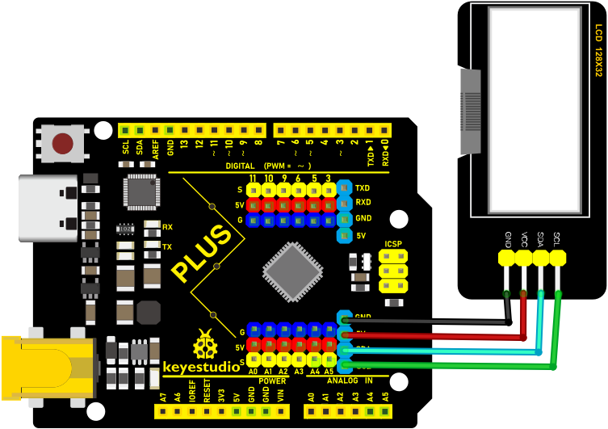

####   **5.Code**

Note: The library file is required in the code. If you have already added the “**lcd**” library file, you can ignore the process of adding library files.

Put the decompressed “**LCD_128X32**” folder into “Arduino libraries” under the compiler installation directory.

After successful placement, you need to restart the compiler, otherwise the compilation will not work.

e.g ：C:\Program Files\Arduino\libraries

```c
/*
Keyestudio 2021 starter learning kit
Project 16
I2C LCD_128X32_DOT
http//www.keyestudio.com
*/
#include <lcd.h>  //add library files
lcd Lcd;  //define a Lcd class instance

void setup() {
  Lcd.Init(); //initialize
  Lcd.Clear();  //clear
}

void loop() {
  Lcd.Cursor(0, 4); //Set the first row and the eighth column to display, same as below
  Lcd.Display("KEYESTUDIO"); //Display KEYESTUDIO, same as below
  Lcd.Cursor(1, 0);
  Lcd.Display("ABCDEFGHIJKLMNOPQR");
  Lcd.Cursor(2, 0);
  Lcd.Display("123456789+-*/<>=$@");
  Lcd.Cursor(3, 0);
  Lcd.Display("%^&(){}:;'|?,.~\\[]");
}
```

#### **6.Result**

Upload the project code, wire up and power on, the LCD module display will show "KEYESTUDIO" at the first line.

"ABCDEFGHIJKLMNOPQR" will be displayed at the second line. 

"123456789 + - \* / <> = $ @ " will shown at the third line and "% ^ & () {} :; '|?,. ~ \[\] " will be displayed at the fourth line.

### **Project 17: Small Fan**

####   **1.Introduction**

In the hot summer, we need an electric fan to cool us down, so in this project, we will use the Plus control board to control 130 motor module and small blade to make a small fan.

####   **2.Components Required**

|  |  | 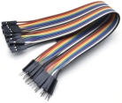 |  |
| ------------------------------------------ | ------------------------------------------------------------ | ------------------------------------------------------------ | ------------------------------------------------------------ |
| Keyestudio Plus Mainboard*1                | 130 Motor Module*1                                           | M-F Dupont Wires                                             | USB Cable*1                                                  |

#### **3.Component Knowledge**


**130 motor module:** 

The motor control module uses the HR1124S motor control chip, which is a single-channel H-bridge driver chip for DC motor. The H-bridge driving part of the HR1124S features low on-resistance PMOS and NMOS power tube. The low on-resistance ensures low power loss of the chip, making the chip work safely for a longer time. In addition, HR1124S has low standby current and low quiescent current, which makes HR1124S easy to be used in toy scheme.

**Features:**

- Working voltage: 5V

- Working current: 200MA

- Working power: 2W

- Working temperature: -10℃~ +50℃


**Schematic diagram:**

[](mediamedia/ee2deb2ed7ae310b953ff178aff3d6c1.emf)

#### **4.Circuit Diagram and Wiring Diagram**


#### **5.Code**

```c
/*
Keyestudio 2021 starter learning kit
Project 17
Small_Fan
http//www.keyestudio.com
*/
void setup(){
  pinMode(A3, OUTPUT);//set A3 to OUTPUT
  pinMode(A2, OUTPUT);//set A2 to OUTPUT
}
void loop(){
//Set to rotate for 3000ms anticlockwise
  digitalWrite(A3,LOW);
  digitalWrite(A2,HIGH);
  delay(3000);
//et to stop rotating for 1000ms anticlockwise
  digitalWrite(A3,LOW);
  digitalWrite(A2,LOW);
  delay(1000);
//Set to rotate for 3000ms clockwise
  digitalWrite(A3,HIGH);
  digitalWrite(A2,LOW);
  delay(3000);
}
```

#### **6.Result**

Upload the test code successfully, wire up and power on. The small fan will first rotates counterclockwise for 3000ms stops for 1000ms, and then clockwise for 3000ms.

### **Project 18: Servo Rotation**

#### **1.Introduction**

Servo is a kind of motor that can rotate very precisely. It has been widely used in toy cars, RC helicopters, airplanes, robots, etc. In this project, we will use the PLUS mainboard to control the rotation of the servo.

#### **2.Components Required**

|  |  |  |
| ------------------------------------------ | ------------------------------------------------------------ | ------------------------------------------------------------ |
| Keyestudio Plus Mainboard*1                | Servo*1                                                      | USB Cable*1                                                  |

#### **3.Component Knowledge**

**Servo:**


The servo is a kind of position servo driver, which is mainly composed of housing, circuit board, coreless motor, gear and position detector. The working principle is that the receiver or microcontroller sends a signal to the servo, which has an internal reference circuit that generates a reference signal with a period of 20ms and a width of 1.5ms, and compares the DC bias voltage with the voltage of the potentiometer to output voltage difference. The IC on the circuit board determines the direction of rotation, and then drives the coreless motor to start rotation and transmits the power to the swing arm through the reduction gear, while the position detector sends back a signal to determine whether it has reached the positioning. It is suitable for those control systems that require constant change of angle and can be maintained. When the motor rotates at a certain speed, the potentiometer is driven by the cascade reduction gear to rotate so that the voltage difference is 0 and the motor stops rotating. The angle range of general servo rotation is 0 to 180 degrees.

The pulse period for controlling the servo is 20ms, the pulse width is 0.5ms to 2.5ms, and the corresponding position is -90° to +90°. The following is an example of a 180 degree servo.


Servo motors have many specifications, but they all have three connecting wires, which are brown, red, and orange (different brands may have different colors). The brown is GND, the red is the positive power supply, and the orange is the signal line.


#### **4.Wiring Diagram**

| Servo | Plus mainboard |
| :-: | :-: |
| Red line | 5V |
| Brown line | G |
| Orange line | 9(S) |


#### **5.Code**

Note: The library files need to be installed in the code. If you have already added the Servo library files, ignore the process of adding the library files below.

Decompress the library files in the folder, that is, put the decompressed “**Servo**” folder into “Arduino libraries” under the compiler installation directory.

After successful placement, you need to restart the compiler, otherwise the compilation will not work.

e.g ：C:\\Program Files\\Arduino\\libraries

```c
/*
Keyestudio 2021 starter learning kit
Project 18
Servo Rotation
http//www.keyestudio.com
*/
#include <Servo.h>
Servo myservo;// define the name of the servo
void setup()
{
myservo.attach(9);// select the pin of the servo(9)
}
void loop()
{
myservo.write(0);// set the rotation angle of the motor
delay(500);
myservo.write(45);// set the rotation angle of the motor
delay(500);
myservo.write(90);// set the rotation angle of the motor
delay(500);
myservo.write(135);// set the rotation angle of the motor
delay(500);
myservo.write(180);// set the rotation angle of the motor
delay(500);
}
```

#### **6\. Result**

After upload the code to the Plus Mainboard, wire up and power on, the servo will rotate 0°, 45°, 90°, 135°, and 180°.

### **Project 19: Stepper Motor**

#### **1.Introduction**

Stepper motors are accurately positioned and are the most important components in industrial robots, 3D printers, large lathes, and other mechanical devices. In this project, we will use a stepper motor and a clock paper card to make a clock model.

#### **2.Components Required**

|  |  |  |  |  |
| ------------------------------------------ | ------------------------------------------ | ------------------------------------------------------------ | ------------------------------------------------------------ | ------------------------------------------------------------ |
| Keyestudio Plus Mainboard*1                | ULN2003 Stepper Motor Drive Board*1        | Stepper Motor *1                                             | M-F Dupont Wires                                             | USB Cable*1                                                  |

#### **3.Component Knowledge**


**Stepper motor:** 

It is a motor controlled by a series of electromagnetic coils. It can rotate by the exact number of degrees (or steps) needed, allowing you to move it to a precise position and keep it there. It does this by supplying power to the coil inside the motor in a very short time, but you must always supply power to the motor to keep it in the position you want. There are two basic types of stepping motors, namely unipolar stepping motor and bipolar stepping motor. 

In this project, we use a 28-BYJ48 unipolar stepper motor.


**Working Principle:**

The stepper motor is mainly composed of a stator and a rotor. The stator is fixed. As shown in the figure below, the part of the coil group A, B, C, and D will generate a magnetic field when the coil group is energized. The rotor is the rotating part. As follows, the middle part of the stator, two poles are permanent magnets.


Single -phase four beat: At the beginning, the coils of group A are turned on, and the poles of the rotor point at A coil. Next, the group A coil are disconnected, and the group B coils are turned on. The rotor will turn clockwise to the group B. Then, group B is disconnected, group C is turned on, and the rotor is turned to group C. After that, group C is disconnected, and group D is turned on, and the rotor is turned to group D. Finally, group D is disconnected, group A is turned on, and the rotor is turned to group A coils. Therefore, rotor turns 180° and continuously rotates B-C-D-A, which means it runs a circle (eight phase). As shown below, he rotation principle of stepper motor is A - B - C - D - A.

You make order inverse(D - C - B - A - D .....) if you want to make stepper motor rotate anticlockwise.


Half-phase and eight beat: 8 beat adopts single and dual beat way，A - AB - B - BC - C - CD - D - DA - A ......, rotor will rotate half phase in this order. 

For example, when A coil is electrified, rotor faces to A coil then A and B coil are connected, on this condition, the strongest magnetic field produced lies in the central part of AB coil, which means rotating half-phase clockwise.

**Stepper Motor Parameters:**

The rotor rotates one circle when the stepper motor we provide rotates 32 phases and with the output shaft driven by 1:64 reduction geared set. Therefore the rotation (a circle) of output shaft requires 2048 phases

The step angle of 4-beat mode of 5V and 4-phase stepper motor is 11.25. And the step angle of 8-beat mode is 5.625, the reduction ratio is 1:64.

**ULN2003Stepper Motor Drive Board:** It is stepper motor driver.

The following schematic diagram shows how to use the ULN2003 stepper motor driver board interface to connect a unipolar stepper motor to the pins of the Plus control board, and shows how to use four TIP120 interfaces.


#### **4.Schematic Diagram and Wiring Diagram**


#### **5\. Code**

```c
/*
Keyestudio 2021 starter learning kit
Project 19
Stepper_motor
http//www.keyestudio.com
*/
// pins of the stepper motor
const int IN1_pin = 11;
const int IN2_pin = 10;
const int IN3_pin = 9;
const int IN4_pin = 8;
int val; 
void setup() {
Serial.begin(9600);
// the setting of pins of stepper motor in Arduino
pinMode(IN1_pin,OUTPUT);
pinMode(IN2_pin,OUTPUT);
pinMode(IN3_pin,OUTPUT);
pinMode(IN4_pin,OUTPUT);
}
void loop() {
int a = 1024;
int b = 1024;
val=Serial.read();
if(val=='A')
{
while(a--)
{
digitalWrite(IN1_pin, HIGH);
digitalWrite(IN2_pin, LOW);
digitalWrite(IN3_pin, LOW);
digitalWrite(IN4_pin, LOW);
delay(10);
digitalWrite(IN1_pin, LOW);
digitalWrite(IN2_pin, HIGH);
digitalWrite(IN3_pin, LOW);
digitalWrite(IN4_pin, LOW);
delay(10);
digitalWrite(IN1_pin, LOW);
digitalWrite(IN2_pin, LOW);
digitalWrite(IN3_pin, HIGH);
digitalWrite(IN4_pin, LOW);
delay(10);
digitalWrite(IN1_pin, LOW);
digitalWrite(IN2_pin, LOW);
digitalWrite(IN3_pin, LOW);
digitalWrite(IN4_pin, HIGH);
delay(10);
}
}
if(val=='C')
{
while(b--)
{
digitalWrite(IN4_pin, HIGH);
digitalWrite(IN3_pin, LOW);
digitalWrite(IN2_pin, LOW);
digitalWrite(IN1_pin, LOW);
delay(10);
digitalWrite(IN4_pin, LOW);
digitalWrite(IN3_pin, HIGH);
digitalWrite(IN2_pin, LOW);
digitalWrite(IN1_pin, LOW);
delay(10);
digitalWrite(IN4_pin, LOW);
digitalWrite(IN3_pin, LOW);
digitalWrite(IN2_pin, HIGH);
digitalWrite(IN1_pin, LOW);
delay(10);
digitalWrite(IN4_pin, LOW);
digitalWrite(IN3_pin, LOW);
digitalWrite(IN2_pin, LOW);
digitalWrite(IN1_pin, HIGH);
delay(10);
}
}
digitalWrite(IN4_pin, LOW);
digitalWrite(IN3_pin, LOW);
digitalWrite(IN2_pin, LOW);
digitalWrite(IN1_pin, LOW);
}
```

#### **6\. Result**

Upload the project code to the PLUS Mainboard, wire up and power on first. Then open the serial monitor, set the baud rate to 9600. We enter "A" in the serial monitor and click "send", the stepper motor rotates counterclockwise rotation. Enter "C" in the serial monitor and click "send", the stepper motor rotates clockwise.

### **Project 20: Relay**

#### **1.Introduction**

In daily life, we generally use AC to drive electrical equipment, and sometimes we use switches to control electrical appliances. If the switch is directly connected to the AC circuit, once electricity leakage occurs, people are in danger. From a safety point of view, we specially designed this relay module with NO (normally open) and NC (normally closed) terminals. In this lesson we will learn a special and easy-to-use switch, which is the relay module.

#### **2.Components Required**

|  |  |  |  |
| ------------------------------------------ | ------------------------------------------------------------ | ------------------------------------------------------------ | ------------------------------------------------------------ |
| Keyestudio Plus Mainboard*1                | Relay Module*1                                               | F-F Dupont Wires                                             | USB Cable*1                                                  |

#### **3.Component Knowledge**


**Relay:** 

It is an "automatic switch" that uses a small current to control the operation of a large current.

- Input voltage：5V

- Rated load：5A 250VAC (NO/NC) 5A 24VDC (NO/NC)


The rated load means that a 5V Arduino can be used to control a device with a 24V DC voltage or a 250V AC voltage.

**Schematic diagram of the Relay:**


#### **4.Schematic Diagram and Wiring Diagram**


#### **5.Code**

```c
/*
Keyestudio 2021 Starter Kit
Project 20
Relay
http//www.keyestudio.com
*/
int Relay = 3; // defines digital 3
void setup()
{
pinMode(Relay, OUTPUT); // sets "Relay" to "output"
}
void loop()
{
digitalWrite(Relay, HIGH); // turns on the relay
delay(2000); //delays 2 seconds
digitalWrite(Relay, LOW); // turns off the relay
delay(2000); // delays 2 seconds
}
```

#### **6.Result**

Upload the code to the mainboard successfully, wire up and power on, the relay will be turned on (ON end is connected) for 2 seconds, and stop (NC end is connected) for 2 seconds, circularly

### **Project 21: Dimming Light**

#### 1.Introduction

A potentiometer is a three-terminal resistor with a sliding or rotating contact that forms an adjustable voltage divider. It works by varying the position of a sliding contact across a uniform resistance. In a potentiometer, the entire input voltage is applied across the whole length of the resistor, and the output voltage is the voltage drop between the fixed and sliding contact.

In this project, we are going to learn how to use Arduino to read the values of the potentiometer, and make a dimming lamp.

#### **2.Components Required**

|                    |  |  |  |
| ------------------------------------------------------------ | ------------------------------------------------------------ | ------------------------------------------------------------ | ------------------------------------------------------------ |
| Keyestudio Plus Mainboard*1                                  | Potentiometer*1                                              | Red LED*1                                                    | 200Ω Resistor*1                                              |
|  |  |  |                                                              |
| Breadboard*1                                                 | USB Cable*1                                                  | Jumper Wires                                                 |                                                              |

#### **3.Component Knowledge**


**Adjustable potentiometer:** 

It is a kind of resistor and an analog electronic component, which has two states of 0 and 1(high level and low level). The analog quantity is different, its data state presents a linear state such as 0 to 1023.

#### **4.Read the Potentiometer Value**

We connect the adjustable potentiometer to the analog pin of Arduino to read its value. Please refer to the following wiring diagram for wiring.


```c
/*
Keyestudio 2021 Starter Kit
Project 21.1
Read_the_adjustable_potentiometer_analog_value
http//www.keyestudio.com
*/
int potpin=A1;// initializes analog PIN A1 of the potentiometer
int val=0;// defines "val" with an initial value of 0
void setup()
{
Serial.begin(9600);// sets baudrate to 9600
}
void loop()
{
val=analogRead(potpin);// reads the analog value of analog PIN A1 and assigns it to "val"
Serial.println(val);// displays the value of "val"
}
```

Upload the code to the Plus mainboard, connect the wires and power on first. Open the serial monitor, set the baud rate to 9600. When you rotate the potentiometer knob, you can see the displayed value change. After calculation, you can get the corresponding value you need.

Below figure shows the analog value it reads.


#### **5.Circuit Diagram and Wiring Diagram**

In the last step, we read the value of the potentiometer, and now we need to convert the value of the potentiometer into the brightness of the LED to make a lamp that can adjust the brightness. The wiring diagram is as follows.


#### **6.Code**

```c
/*
Keyestudio 2021 Starter Kit
Project 21.2
Dimming_light
http//www.keyestudio.com
*/
int potpin=A1;// initializes analog PIN A1 of the adjustable potentiometer
int ledpin=11;// initializes the digital PIN 11
int val=0;// defines "val" with an initial value of 0
void setup()
{
pinMode(ledpin,OUTPUT);// sets digital pin to "output"
Serial.begin(9600);// sets baudrate to 9600
}
void loop()
{
val=analogRead(potpin);// reads the analog value of analog PIN A1 and assigns it to "val"
analogWrite(ledpin,val/4);
Serial.println(val);// displays the value of "val"
}
```

#### **7.Result**

Upload the code to the Mainboard, connect the wires and power on first. Then open the serial monitor, set the baud rate to 9600, and the monitor will display the value of potentiometer. When we turn the knob of the potentiometer, the brightness of the LED will change.

### **Project 22: Flame Alarm**

#### **1.Introduction**

In this project, we will use the Plus mainboard, a flame sensor and a buzzer to make fire alarm devices.

#### **2.Components Required**

|  |  |  |  |  |  |  |
| ------------------------------------------ | ------------------------------------------------------------ | ------------------------------------------------------------ | ------------------------------------------------------------ | ------------------------------------------------------------ | ------------------------------------------------------------ | ------------------------------------------------------------ |
| Keyestudio Plus Mainboard*1                | Flame Sensor*1                                               | Active Buzzer*1                                              | Breadboard*1                                                 | Jumper Wires                                                 | USB Cable*1                                                  | 10KΩ Resistor*1                                              |

#### **3.Component Knowledge**


**Flame Sensor**

The flame emits a certain degree of IR light, which is invisible to the human eye, but our flame sensor can detect it and alert the microcontroller. If the Arduino has detected a fire, it has a specially designed infrared receiver to detect the flame, and then convert the flame brightness into a fluctuating level signal. The short pin of the receiving triode is negative pole and the other long pin is positive pole. We should connect the short pin (negative pole) to 5V and the long pin (positive pole) to the analog pin, a resistor and GND. As shown in the figure below.


Note: Since vulnerable to radio frequency radiation and temperature changes, the flame sensor should be kept away from heat sources like radiators, heaters and air conditioners, as well as direct irradiation of sunlight, headlights and incandescent light.

#### **4.Read the Simulation Value**

We start with a simple code to read the value of the flame sensor and print it on the serial monitor. For wiring, please refer to the following wiring diagram.


```c
/*
Keyestudio 2021 Starter Kit
Project 22.1
Read_the_flame_sensor_analog_value
http//www.keyestudio.com
*/
int flamepin=A1;// initializes analog PIN A1
int val=0;// defines "val" with an initial value of 0
void setup()
{
Serial.begin(9600);// sets baudrate to 9600
}
void loop()
{
val=analogRead(flamepin);// reads the analog value of analog PIN A1 and assigns it to "val"
Serial.println(val);// displays the value of "val"
}
```

Upload the code to the Plus Mainboard, connect the wires and power on first. Turn on the serial monitor and set the baud rate to 9600, and approach the flame sensor with a lighter flame to see its analog value.


#### **5.Circuit Diagram and Wiring Diagram**

Next, we will use flame sensor and buzzer, RGB LED to make an interesting project, that is flame alarm. When flame is detected, RGB LED is red and buzzer alarms.

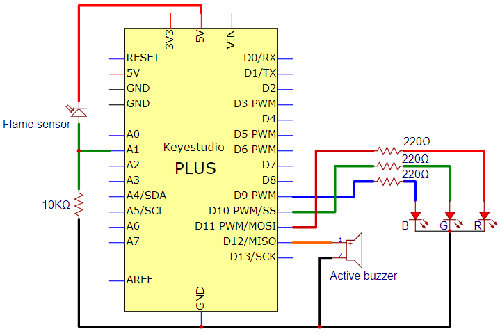


#### **6.Code**

```c
/*
Keyestudio 2021 Starter Kit
Project 22.2
Fire_alarm
http//www.keyestudio.com
*/
const int red = 11;
const int green = 10;
const int blue= 9;
const int buzzer = 12;
const int flamepin = A1;
const int thereshold = 30;
void setup() {
  // puts the setup code here and runs it once
  Serial.begin(9600);
  pinMode(red, OUTPUT);
  pinMode(green, OUTPUT);
  pinMode(blue, OUTPUT);
  pinMode(buzzer, OUTPUT);
  pinMode(flamepin, INPUT);
 
}
void setColor(int redValue, int greenValue, int blueValue)
 {
analogWrite(red, redValue);
analogWrite(blue, blueValue);
analogWrite(green, greenValue);
}
 
void loop() {
  // puts the main code here and repeats
  int flamesenseval = analogRead(flamepin);
  Serial.println(flamesenseval);
  if (flamesenseval >= thereshold) {
    setColor(255, 0, 0); //red
    tone(buzzer, 1000);
    delay(10);
  }
  else
  {
    setColor(0, 255, 0); // green
    noTone(buzzer);
  }
}
```

#### **7.Result**

Upload the code to the Plus Mainboard, connect the wires and power on first. Then open the serial monitor and set the baud rate to 9600, the monitor will display the value of the flame sensor. We use light the fire and keep it close to the flame sensor, the RGB LED will become red and the buzzer will alarm. Otherwise, the RGB LED will turn green and the buzzer doesn’t emit sounds.

### **Project 23: Optic Control Lamp**

#### **1.Introduction**

Sensors or components are ubiquitous in our daily life. For example, some public street lights turn on automatically at night and turn off automatically during the day. These make use of a photosensitive element that senses the intensity of external ambient light. When the outdoor brightness decreases at night, the street lights will automatically turn on. In the daytime, the street lights will automatically turn off. The principle of this is very simple.

In this lesson we will implement the function of this street light.

#### **2.Components Required**

|                                     |  |  |  |
| ----------------------------------------------------------- | ---------------------------------------------------------- | ----------------------------------------------------------- | ----------------------------------------------------------- |
| Keyestudio Plus Mainboard*1                                 | Photoresistor*1                                            | Red LED*1                                                   | 220Ω Resistor*1                                             |
|  |                 |                  |                  |
| 10KΩ Resistor*1                                             | Breadboard*1                                               | Jumper Wires                                                | USB Cable*1                                                 |

#### **3.Component Knowledge**


**Photoresistor:**

Photosensor is a kind of resistor made by using the photoelectric effect of semiconductor, the resistance value changes with the intensity of the incident light, also known as photoelectric detector. When the surrounding light becomes stronger, the resistance becomes smaller and the analog signal becomes larger. Conversely, when the light becomes weaker, the resistance increases and the analog signal becomes smaller.

The commonly used material for making photosensor is cadmium sulfide, in addition to selenium, aluminum sulfide, lead sulfide and bismuth sulfide and so on. These materials have the characteristic that their resistance decreases rapidly under the irradiation of light of a specific wavelength. This is because the carriers generated by the light are involved in the conduction and drift under the action of the applied electric field. The electrons rush to the positive electrode of the power supply, and the holes rush to the negative electrode of the power supply, so that the resistance of the photosensor drops rapidly.

Photoresistor is commonly applied in the measurement of light, light control and photovoltaic conversion (convert the change of light into the change of electricity).

Photoresistor is also being widely applied to various light control circuit, such as light control and adjustment, optical switches, etc.

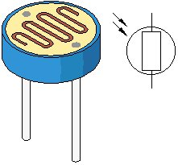

We will start with a relatively simple experiment regarding to photovaristor application.

#### **4.Read the Analog Value**

We first use a simple code to read the value of the photoresistor, print it in the serial monitor. For wiring, please refer to the following wiring diagram.


```c
/*
Keyestudio 2021 Starter Kit
Project 23.1
Read_the_photosensitive_resistance_analog_value
http//www.keyestudio.com
*/
int photocellpin=A0;// initializes the analog PIN A0 connected to the photoresistor
int val=0;// initializes the variable "val" with a value of 0
void setup()
{
Serial.begin(9600);// sets baudrate to 9600
}
void loop()
{
val=analogRead(photocellpin);// reads the value of the sensor and assigns its value to "val"
Serial.println(val);// displays the value of "val"
delay(200);// waits 0.2 second
}
```

Upload the code to the Plus Mainboard, wire up and power up, open the serial monitor and set the baud rate to **9600**. Then you can read the analog value of photoresistor. When the light intensity around the sensor gets dim, the analog value displayed on the serial monitor will gradually reduce. On the contrary, the analog value will gradually increase.

[](mediamedia/d70b554877a3c3222ca27ebdb0812e76.png)

#### **5.Circuit Diagram and Wiring Diagram**

Next, we make an optical control lamp.


#### **6.Code**

```c
/*
Keyestudio 2021 Starter Kit
Project 23.2
Optical Control Lamp
http//www.keyestudio.com
*/
int photocellpin=A0;// initializes the analog PIN A0 connected to the photoresistor
int ledpin=11;//  initializes digital PIN 11
int val=0;// initializes the variable "val" with a value of 0
void setup()
{
pinMode(ledpin,OUTPUT);// sets digital PIN 11 to "output"
Serial.begin(9600);// sets baudrate to 9600
}
void loop()
{
val=analogRead(photocellpin);//reads the analog value of the sensor and assigns its value to "val"
Serial.println(val);//displays the value of "val"
analogWrite(ledpin,val/4);//sets brightness (Max:255)
delay(10);// waits 0.01 second
}
```

#### **7.Result**

Upload the code to the Plus Mainboard, wire up and power up, open the serial monitor and set the baud rate to **9600**.

Then you can read the analog value of photoresistor. When the light intensity around the sensor gets dim, the analog value displayed on the serial monitor will gradually reduce. On the contrary, the analog value will gradually increase.

### **Project 24: Voice Control Fan**

#### **1.Introduction**

The sound sensor has a built-in capacitive electret microphone and power amplifier. It can be used to detect the sound intensity of the environment.

In this project, we use a sound sensor and a 130 motor to make a voice-activated smart fan.

#### **2.Components Required**

|  |  |  |  |  |
| ----------------------------------------- | ----------------------------------------------------------- | ----------------------------------------------------------- | ----------------------------------------------------------- | ----------------------------------------------------------- |
| Keyestudio Plus Mainboard*1               | Sound Sensor*1                                              | 130 Motor Module*1                                          | USB Cable*1                                                 | F-F Dupont Wires                                            |

#### **3.Component Knowledge**


**Sound sensor** is usually used to detect the loudness of the sound in the surroundings. Arduino can collect its output signal through the analog input interface. The S pin is an analog output, which is the real-time output of the microphone voltage signal. The sensor comes with a potentiometer so you can adjust the signal strength. It also has two fixing holes so that the sensor can be installed on any other equipment. You can use it to make some interactive works, such as voice-operated switches.

#### **4.Read the Analog Value of the Sound Sensor**

We first use a simple code to read the analog value of the sound sensor and print it to the serial monitor, please refer to the following wiring diagram for the wiring.


```c
/*
Keyestudio 2021 Starter Kit
Project 24.1
Read_the_sound_sensor_analog_value
http//www.keyestudio.com
*/
int soundpin=A1;// initializes the analog PIN A1 of the sound sensor
int val=0;// initializes the variable "val" with a value of 0
void setup()
{
Serial.begin(9600);// sets baudrate to 9600
}
void loop()
{
val=analogRead(soundpin);// reads the analog value of the sensor and assigns its value to "val"
Serial.println(val);// displays the value of "val"
delay(1000);// waits a second
}
```

Upload the code to the Plus Mainboard, connect the wires and power on first. Open the serial monitor, set the baud rate to 9600, and tap or clap the sensor, you can see that the analog value of the sound sensor has changed significantly.


#### **5.Schematic Diagram and Wiring Diagram**

Next, we use a sound sensor, a 130 motor module and a fan leaf to make a voice-activated fan. The schematic diagram and wiring diagram is as follows.


#### **6.Code**

```c
/*
Keyestudio 2021 Starter Kit
Project 24.2
Voice control fan
http//www.keyestudio.com
*/
void setup() {
  Serial.begin(9600);
  pinMode(A3, OUTPUT);//sets digital A3 to "output"
  pinMode(A2, OUTPUT);//sets digital A2 to "output"
}
void loop() {
  int Soundvalue = analogRead(A1);  // reads the analog value
  Serial.println(Soundvalue);
  if(Soundvalue>700)
  {
   // when the analog value is greater than the set value, starts the motor
   digitalWrite(A3,HIGH);
   digitalWrite(A2,LOW);
   for(int i=0;i<5;i++){
   delay(5000);                    //  waits 5 seconds
   }
  }
  else{
   // closes the motor
   digitalWrite(A3,LOW);
   digitalWrite(A2,LOW);
    }
}
```

#### **7.Result**

Upload the code to the PLUS Mainboard, connect the wires and power on. Then open the serial monitor, set the baud rate to 9600. The serial monitor displays the analog value of the sound. We blow into the sound sensor, the louder the sound is, the larger the analog value displayed on the serial monitor. When the value is greater than 700, the fan starts to work.

（Turn the blue potentiometer to adjust the sensitivity of the sound sensor）

### **Project 25: Temperature Measurement**

#### **1.Introduction**

LM35 is a commonly used and easy-to-use temperature sensor. It does not require other hardware, only needs an analog port. The difficulty lies in compiling the code and converting the analog values to Celsius temperature. In this project, we use a temperature sensor and 3 LEDs to make a temperature tester. When the temperature sensor touches objects with different temperature, the LED will show different colors.

#### **2.Components Required**

|                    |  |  |  |   |
| ----------------------------------------------------------- | ----------------------------------------------------------- | ----------------------------------------------------------- | ----------------------------------------------------------- | ------------------------------------------------------------ |
| Keyestudio Plus Mainboard*1                                 | LM35 Temperature Sensor*1                                   | 220Ω Resistor*3                                             | Red LED*1                                                   | Yellow LED*1                                                 |
|  |  |  |  |  |
| F-F Dupont Wires                                            | Green LED*1                                                 | Breadboard*1                                                | Jumper Wires                                                | USB Cable*1                                                  |

#### **3.Component Knowledge**


**Working principle of LM35 temperature sensor:** 

LM35 is a widely used temperature sensor with many different package types. At room temperature, it can achieve the accuracy of 1/4°C without additional calibration processing. LM35 temperature sensor can produce different voltage by different temperature. When the temperature is 0 ℃, it outputs 0V. If increasing 1 ℃, the output voltage will increase 10mv.

The output temperature is 0℃ to 100℃, the conversion formula is as follows.


#### **4.Read the Temperature Value**

We first use a simple code to read the value of the temperature sensor, print it in the serial monitor. The wiring diagram is shown below.


LM35 output is given to analog pin A1 of the Plus mainboard. This analog voltage is converted to its digital form and processed to get the temperature reading.

```c
/*
Keyestudio 2021 Starter Kit
Project 25.1
Read_the_LM35_temperature_value
http//www.keyestudio.com
*/
#define sensorPin A1
void setup()
{
   Serial.begin(9600);
}
void loop()
{
  long reading = analogRead(sensorPin);
  float voltage = reading * 5.0;
  voltage /= 1024.0;
  float temperatureC = (500 * reading) /1024 ;
  float temperatureF = (temperatureC * 9.0 / 5.0) + 32.0;
  Serial.print(voltage); Serial.print(" volts  -  ");
  Serial.print(temperatureC); Serial.print(" degrees C  -  ");
  Serial.print(temperatureF); Serial.println(" degrees F");
  delay(100);
}
```

Upload the code to the Plus Mainboard, connect the wires and power on first. Then turn on the serial monitor , set the baud rate to 9600 and you can read the current temperature value.


#### **5.Circuit Diagram and Wiring Diagram**

Now we use a LM35 temperature sensor and three LED lights to do a temperature test. When the LM35 temperature sensor senses different temperatures, different LED lights will light up. Follow the diagram below for wiring.


#### **6.Code**

Note: The value of “temperature F” in the code can be adjusted appropriately according to the local temperature value.

```c
/*
Keyestudio 2021 Starter Kit
Project 25.2
Temperature_measurement
http//www.keyestudio.com
*/
#define sensorPin  A1
#define greenLED 8
#define yellowLED 9
#define redLED 10
void setup()
{
  pinMode(greenLED, OUTPUT);
  pinMode(yellowLED, OUTPUT);
  pinMode(redLED, OUTPUT);
  Serial.begin(9600);
}
void loop()
{
  long reading = analogRead(sensorPin);
  float voltage = reading * 5.0;
  voltage /= 1024.0;
  float temperatureC = (500 * reading) /1024 ; 
  float temperatureF = (temperatureC * 9.0 / 5.0) + 32.0;
  Serial.print(voltage); Serial.print(" volts  -  ");
  Serial.print(temperatureC); Serial.print(" degrees C  -  ");
  Serial.print(temperatureF); Serial.println(" degrees F");

  if (temperatureF >= 75) {
    digitalWrite(greenLED, LOW);
    digitalWrite(yellowLED, LOW);
    digitalWrite(redLED, HIGH);
  }
  else if (temperatureF >= 70 && temperatureF < 75) {
    digitalWrite(greenLED, LOW);
    digitalWrite(yellowLED, HIGH);
    digitalWrite(redLED, LOW);
  }
  else {
    digitalWrite(greenLED, HIGH);
    digitalWrite(yellowLED, LOW);
    digitalWrite(redLED, LOW);
  }

  delay(3000);
}
```

#### **7.Result**

Upload the code to the Plus Mainboard, wire up and power on. Then open the serial monitor, set the baud rate to 9600. The monitor displays the current temperature value. When the LM35 temperature sensor senses different temperatures, different LED lights will light up.

### **Project 26: Ultrasonic Ranger**

#### **1. Introduction**  

The HC-SR04 ultrasonic sensor is a very affordable distance sensor, mainly used for obstacle avoidance in various robotic projects. It is also used for water level sensing and even as a parking sensor. We treat the ultrasonic sensors as bat's eyes. In the dark, bats can still identify objects in front of them and directions through ultrasound.

#### **2.Components Required**

|                    |  |  |  |
| ----------------------------------------------------------- | ----------------------------------------------------------- | ----------------------------------------------------------- | ----------------------------------------------------------- |
| Keyestudio Plus Mainboard*1                                 | Ultrasonic Sensor*1                                         | 220Ω Resistor*4                                             | Red LED*4                                                   |
|  |  |  |  |
| M-F Dupont Wires                                            | USB Cable*1                                                 | Breadboard*1                                                | Jumper Wires                                                |

#### **3\. Component Knowledge**

**HC-SR04 ultrasonic sensor:** Like bats, sonar is used to determine the distance to an object. It provides accurate non-contact range detection, high-precision and stable readings. Its operation is not affected by sunlight or black materials, just like a precision camera (acoustically softer materials like cloth are difficult to detect). It has an ultrasonic transmitter and receiver.

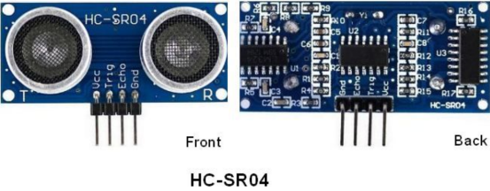

In front of the ultrasonic sensor are two metal cylinders, these are the converters. The converters convert the mechanical energy into an electrical signal. In the ultrasonic sensor, there are transmitting converters and receiving converters. The transmitting converter converts the electric signal into an ultrasonic pulse, and the receiving converter converts the reflected ultrasonic pulse back to an electric signal. If you look at the back of the ultrasonic sensor, you will see an IC behind the transmitting converter, which controls the transmitting converter. 

There is also an IC behind the receiving converter, which is a quad operational amplifier that amplifies the signal generated by the receiving converter into a signal large enough to be transmitted to the Arduino.

**Sequence diagrams:**

The figure shows the sequence diagram of the HC-SR04. To start the measurement, the Trig of SR04 must receive at least 10us high pulse (5V), which will activate the sensor to emit 8 cycles of 40kHz ultrasonic pulses, and wait for the reflected ultrasonic pulses. When the sensor detects ultrasound from the receiver, it sets the Echo pin to high (5V) and delays it by one cycle (width), proportional to the distance. To get the distance, measure the width of the Echo pin.


Time = Echo pulse width, its unit is “us” (microseconds)

Distance in centimeters = time / 58

Distance in inches = time / 148

#### **4.Read the Distance Value**

We will start with a simple ultrasonic distance measurement and output the measured distance on the serial monitor.

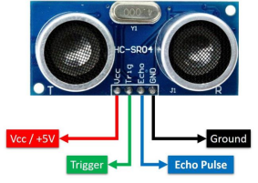

The HC-SR04 ultrasonic sensor has four pins, they are Vcc, Trig, Echo and GND. The Vcc pin provides the power source for generating ultrasonic pulses and is connected to Vcc (+5V). The GND pin is grounded. The Trig pin is where the Arduino sends a signal to start the ultrasonic pulse. The Echo pin is where the ultrasonic sensor sends information about the duration of the ultrasonic pulse to the Plus control board. Wiring as shown below.


```c
/*
Keyestudio 2021 starter learning kit
Project 26.1
Read_the_ultrasonic_distance
http//www.keyestudio.com
*/
const int trig = 12;
const int echo = 13;
int duration = 0;
int distance = 0;
void setup() 
{
  pinMode(trig , OUTPUT);
  pinMode(echo , INPUT);
  Serial.begin(9600);
}
void loop()
{
  digitalWrite(trig , HIGH);
  delayMicroseconds(1000);
  digitalWrite(trig , LOW);
  duration = pulseIn(echo , HIGH);
  distance = (duration/2) / 28.5 ;
  Serial.print(distance);
  Serial.println("cm");
}
```

Upload the code to the Plus Mainboard, connect the wires and power on first. Then open the serial monitor, set the baud rate to 9600. When an object is placed in front of the ultrasonic sensor (near or far), it will detect the distance of the object and the value will be displayed on the monitor.


#### **5.Circuit Diagram and Wiring Diagram**

Next, we will make a simple ultrasonic ranger using an ultrasonic sensor and 4 LED lights. Connect the wires as shown below.


#### **6.Code**

```c
/*
Keyestudio 2021 starter learning kit
Project 26.2
Ultrasonic_Ranger
http//www.keyestudio.com
*/
const int trig = 12;
const int echo = 13;
const int LED1 = 11;
const int LED2 = 10;
const int LED3 = 9;
const int LED4 = 8;
int duration = 0;
int distance = 0;
void setup() 
{
  pinMode(trig , OUTPUT);
  pinMode(echo , INPUT);
  pinMode(LED1 , OUTPUT);
  pinMode(LED2 , OUTPUT);
  pinMode(LED3 , OUTPUT);
  pinMode(LED4 , OUTPUT);
  Serial.begin(9600);
}
void loop()
{
  digitalWrite(trig , HIGH);
  delayMicroseconds(1000);
  digitalWrite(trig , LOW);
  duration = pulseIn(echo , HIGH);
  distance = (duration/2) / 28.5;
  Serial.println(distance);
    if ( distance <= 7 )
  {
    digitalWrite(LED1, HIGH);
  }
  else
  {
    digitalWrite(LED1, LOW);
  }
  if ( distance <= 14 )
  {
    digitalWrite(LED2, HIGH);
  }
  else
  {
    digitalWrite(LED2, LOW);
  }
  if ( distance <= 21 )
  {
    digitalWrite(LED3, HIGH);
  }
  else
  {
    digitalWrite(LED3, LOW);
  }
  if ( distance <= 28 )
  {
    digitalWrite(LED4, HIGH);
  }
  else
  {
    digitalWrite(LED4, LOW);
  }
}     
```

#### **7\. Result**

Upload the code to the PLUS Mainboard. After connecting the wires and powering on, the ultrasonic module can detect the distance of obstacles ahead. In addition, when we move our hands in front of the ultrasonic sensor, the corresponding LED will light up.

### **Project 27: Control Stepper Motor with Joystick**

####   **1.Introduction**

The joystick module is a component with two analog inputs and one digital input. It is widely used in game operation, robot control, drone control and other fields.

In this project, we will use a Plus mainboard and a joystick module to control the rotation of the stepper motor. You can have a deeper understanding of the principle and operation of the joystick module in practice.

#### **2.Components Required**

|                    |  |  |  |
| ----------------------------------------------------------- | ----------------------------------------------------------- | ----------------------------------------------------------- | ----------------------------------------------------------- |
| Keyestudio Plus Mainboard*1                                 | Joystick Module*1                                           | Stepper Motor*1                                             | USB Cable*1                                                 |
|  |  |  |                                                             |
| ULN2003 Stepper Motor Drive Board*1                         | M-F Dupont Wires                                            | F-F Dupont Wires                                            |                                                             |

#### **3.Component Knowledge**


**Joystick module:** 

It mainly uses PS2 joystick components. In fact, the joystick module has 3 signal terminal pins, which simulate a three-dimensional space. The pins of the joystick module are GND, VCC, and signal terminals (B, X, Y). The signal terminals X and Y simulate the X-axis and Y-axis of the space. When controlling, the X and Y signal terminals of the module are connected to the analog port of the microcontroller. The signal terminal B simulates the Z axis of the space, it is generally connected to the digital port and used as a button.

VCC is connected to the microcontroller power output VCC (3.3V or 5V), GND is connected to the microcontroller GND, the voltage in the original state is about 1.65V or 2.5V. 

In the X-axis direction, when moving in the direction of the arrow, the voltage value increases, and the maximum voltage can be reached. Moving in the opposite direction of the arrow, the voltage value gradually decreases to the minimum voltage. 

In the Y-axis direction, the voltage value decreases gradually as it moves in the direction of the arrow on the module, decreasing to the minimum voltage. As the arrow is moved in the opposite direction, the voltage value increases and can reach the maximum voltage. 

In the Z-axis direction, the signal terminal B is connected to the digital port and outputs 0 in the original state and outputs 1 when pressed. 

In this way, we can read the two analog values and the high and low level conditions of the digital port to determine the operating status of the joystick on the module.

#### **4.Read the Value**

We have to use analog Arduino pins to read the data from X or Y pins, and use digital pins to read the values of the button. Please follow the wiring diagram below for wiring.


```c
/*
Keyestudio 2021 starter learning kit
Project 27.1
Read_the_value_of_the_joystick_module
http//www.keyestudio.com
*/
int VRx = A0;
int VRy = A1;
int SW = 11;
int xPosition = 0;
int yPosition = 0;
int SW_state = 0;
int mapX = 0;
int mapY = 0;
void setup() {
  Serial.begin(9600);
  pinMode(VRx, INPUT);
  pinMode(VRy, INPUT);
  pinMode(SW, INPUT_PULLUP);
}
void loop() {
  xPosition = analogRead(VRx);
  yPosition = analogRead(VRy);
  SW_state = digitalRead(SW);
  mapX = map(xPosition, 0, 1023, -512, 512);
  mapY = map(yPosition, 0, 1023, -512, 512);
  Serial.print("X: ");
  Serial.print(mapX);
  Serial.print(" | Y: ");
  Serial.print(mapY);
  Serial.print(" | Button: ");
  Serial.println(SW_state);
  delay(100);
}
```

Upload the code to the Plus Mainboard, connect the wires and power on first. Then open the serial monitor, set the baud rate to 9600.When you shake the joystick or press the button, you can see their values on the serial monitor.


#### **5.Circuit Diagram and Wiring Diagram**

We just read the value of the joystick module. Now we need to do something with the joystick module and stepper motor, connected according to the following diagram.


#### **6.Code**

```c
/*
Keyestudio 2021 starter learning kit
Project 27.2
Control Stepper Motor with Joystick 
http//www.keyestudio.com
*/
const int X_pin = 0;  // analog pin A0 is connected to X
const int Y_pin = 1;  // analog pin A1 is connected to Y
int SW_pin = 11;
int X_Rotate;
int Y_Rotate;
//the pin of the stepper motor
const int IN1_pin = 10;
const int IN2_pin = 9;
const int IN3_pin = 6;
const int IN4_pin = 5;
void setup() {
  //set the pin of the joystic module
  pinMode(SW_pin, INPUT);
  digitalWrite(SW_pin, HIGH);
  //set the pin of the stepper motor
  pinMode(IN1_pin, OUTPUT);
  pinMode(IN2_pin, OUTPUT);
  pinMode(IN3_pin, OUTPUT);
  pinMode(IN4_pin, OUTPUT);
}
void loop() {
  X_Rotate = analogRead(X_pin);
  Y_Rotate = analogRead(Y_pin);
  if (Y_Rotate < 500) {
    digitalWrite(IN1_pin, HIGH);
    digitalWrite(IN2_pin, LOW);
    digitalWrite(IN3_pin, LOW);
    digitalWrite(IN4_pin, LOW);
    delay((Y_Rotate / 2) + 2);
    digitalWrite(IN1_pin, LOW);
    digitalWrite(IN2_pin, HIGH);
    digitalWrite(IN3_pin, LOW);
    digitalWrite(IN4_pin, LOW);
    delay((Y_Rotate / 2) + 2);
    digitalWrite(IN1_pin, LOW);
    digitalWrite(IN2_pin, LOW);
    digitalWrite(IN3_pin, HIGH);
    digitalWrite(IN4_pin, LOW);
    delay((Y_Rotate / 2) + 2);
    digitalWrite(IN1_pin, LOW);
    digitalWrite(IN2_pin, LOW);
    digitalWrite(IN3_pin, LOW);
    digitalWrite(IN4_pin, HIGH);
    delay((Y_Rotate / 2) + 2);
  } else if (Y_Rotate > 550) {
    digitalWrite(IN4_pin, HIGH);
    digitalWrite(IN3_pin, LOW);
    digitalWrite(IN2_pin, LOW);
    digitalWrite(IN1_pin, LOW);
    delay((1028 - Y_Rotate) / 2);
    digitalWrite(IN4_pin, LOW);
    digitalWrite(IN3_pin, HIGH);
    digitalWrite(IN2_pin, LOW);
    digitalWrite(IN1_pin, LOW);
    delay((1028 - Y_Rotate) / 2);
    digitalWrite(IN4_pin, LOW);
    digitalWrite(IN3_pin, LOW);
    digitalWrite(IN2_pin, HIGH);
    digitalWrite(IN1_pin, LOW);
    delay((1028 - Y_Rotate) / 2);
    digitalWrite(IN4_pin, LOW);
    digitalWrite(IN3_pin, LOW);
    digitalWrite(IN2_pin, LOW);
    digitalWrite(IN1_pin, HIGH);
    delay((1028 - Y_Rotate) / 2);
  } else if (Y_Rotate > 500 && Y_Rotate < 550) {
    digitalWrite(IN4_pin, LOW);
    digitalWrite(IN3_pin, LOW);
    digitalWrite(IN2_pin, LOW);
    digitalWrite(IN1_pin, LOW);
  }
}
```

#### **7.Result**

Upload the code to the Plus Mainboard, connect the wires and power on first. Push the joystick along the positive direction of the Y axis, and the stepper motor will rotate forward. Conversely, if you push the joystick along the reverse direction of the Y axis, the stepper motor will reverse.

### **Project 28: Temperature and Humidity Meter**

####   **1.Introduction**

In winter, the humidity in the air is very low, that is, the air is very dry. Coupled with the cold, the human skin is prone to crack from excessive dryness. Therefore, you need to use a humidifier to increase the humidity of the air at home. But how do you know that the air is too dry? Then you need equipment to detect air humidity.

In this lesson, we will learn how to use the XHT11 temperature and humidity sensor. We use the sensor to create a thermohygrometer and also combined with an LCD\_128X32\_DOT to display the temperature and humidity values.

#### **2.Components Required**

|  |  |  |  |  |
| ----------------------------------------- | ----------------------------------------------------------- | ----------------------------------------- | ----------------------------------------------------------- | ----------------------------------------------------------- |
| Keyestudio Plus Mainboard*1               | Temperature and Tumidity sensor*1                           | LCD_128X32_DOT*1                          | F-F Dupont Wires                                            | USB Cable*1                                                 |

#### **3.Component Knowledge**


**XHT11 temperature and humidity sensor:** 

It is a temperature and humidity composite sensor with calibrated digital signal output. Its accuracy humidity is ±5%RH, temperature is ±2℃. Range humidity is 20 to 90%RH, and temperature is 0 to 50℃. The XHT11 temperature and humidity sensor applies dedicated digital module acquisition technology and temperature and humidity sensing technology to ensure extremely high reliability and excellent long-term stability of the product. 

The XHT11 temperature and humidity sensor includes a resistive-type humidity measurement and an NTC temperature measurement component, which is very suitable for temperature and humidity measurement applications where accuracy and real-time performance are not required.

The operating voltage is in the range of 3.3V to 5.5V. XHT11 has three pins, which are VCC, GND, and S. S is the pin for data output, using serial communication.

**Single bus format definition:**

| **Description** | **Definition** |
| :-: | --- |
| Start signal | Microprocessor pulls data bus (SDA) down at least 18ms for a period of time(Maximum is 30ms), notifying the sensor to prepare data. |
| Response signal | The sensor pulls the data bus (SDA) low for 83µs, and then pulls up for 87µs to respond to the host's start signal. |
| Humidity | The high humidity is an integer part of the humidity data, and the low humidity is a fractional part of the humidity data. |
| Temperature | The high temperature is the integer part of the temperature data, the low temperature is the fractional part of the temperature data. And the low temperature Bit8 is 1, indicating a negative temperature, otherwise, it is a positive temperature. |
| Parity bit | Parity bit=Humidity high bit+ Humidity low bit+temperature high bit+temperature low bit |

**Data sequence diagram:**

When MCU sends a start signal, XHT11 changes from the low-power-consumption mode to the

high-speed mode, waiting for MCU completing the start signal. Once it is completed, XHT11 sends a response signal of 40-bit data and triggers a signal acquisition. The signal is sent as shown in the figure.


Combined with the code, you can understand better.

The XHT11 temperature and humidity sensor can easily add temperature and humidity data to your DIY electronic projects. It is perfect for remote weather stations, home environmental control systems, and farm or garden monitoring systems.

**Specification:**

Working voltage: +5V

Temperature range: 0°C to 50°C, error of ± 2°C

Humidity range: 20% to 90% RH,± 5% RH error

Digital interface

**Schematic diagram:**


#### **4.Read the Value**

First we learned how to use the serial monitor to print the values of the XHT11 sensor. Please connect the wires according to the wiring diagram below.


**Note**：

The library file needs to be installed in the code. If the “**Dht11**” library file has been added, ignore the process of adding the library file below.

Decompress the library files in the folder, that is, put the decompressed “**Dht11**” folder into “Arduino libraries” under the compiler installation directory.

After successful placement, you need to restart the compiler, otherwise the compilation will not work.

e.g：C:\\Program Files\\Arduino\\libraries

```c
/*
Keyestudio 2021 starter learning kit
Project 28.1
Read_the_temperature_and_humidity_values
http//www.keyestudio.com
*/
#include "DHT.h"
#define DHTPIN 11     // connect the DHT sensor to the digital pins
DHT dht(DHTPIN, DHT11);

void setup() {
  Serial.begin(9600);
  Serial.println(F("DHTxx test!"));

  dht.begin();
}

void loop() {
  // wait for a few seconds between two measurment
  delay(2000);

  // It takes about 250 milliseconds to read the temperature or humidity! 
  // 
  float h = dht.readHumidity();
  // the temperature is Celsius (default value)
  float t = dht.readTemperature();
  // Calculate the Fahrenheit temperature (isFahrenheit = true)
  float f = dht.readTemperature(true);

  // fail to read or not, exit(try again).
  if (isnan(h) || isnan(t) || isnan(f)) {
    Serial.println(F("Failed to read from DHT sensor!"));
    return;
  }

  // Calculate the Fahrenheit temperature index 
  float hif = dht.computeHeatIndex(f, h);
  // (isFahreheit = false)
  float hic = dht.computeHeatIndex(t, h, false);

  Serial.print(F("Humidity: "));
  Serial.print(h);
  Serial.print(F("%  Temperature: "));
  Serial.print(t);
  Serial.print(F("°C "));
  Serial.print(f);
  Serial.print(F("°F  Heat index: "));
  Serial.print(hic);
  Serial.print(F("°C "));
  Serial.print(hif);
  Serial.println(F("°F"));
}
```

Upload the code to the Plus Mainboard, connect the wires and power on first. Then open the serial monitor, set the baud rate to 9600, you will see the current temperature and humidity value detected by the XHT11 sensor.


#### **5.Circuit Diagram and Wiring Diagram**

Now we start printing the value of the XHT11 temperature and humidity sensor with LCD screen. We will see the corresponding values on the LCD screen. Let's get started with this project. Please follow the wiring diagram below.


#### **6.Code**

**Note**：The library file needs to be installed in the code.If library files such as “**Dht11**”and “**lcd**” has been added, ignore the process of adding the library file below. Decompress the library files in the folder, that is, put the decompressed “**Dht11**” and “**LCD\_128X32**” folder into “Arduino libraries” under the compiler installation directory.

After successful placement, you need to restart the compiler, otherwise the compilation will not work.

e.g：C:\\Program Files\\Arduino\\libraries

```c
/*
Keyestudio 2021 starter learning kit
Project 28.2
Temperature_and_humidity_meter
http//www.keyestudio.com
*/
#include "DHT.h"
#define DHTPIN 11     // the pin connected the DHT sensor
DHT dht(DHTPIN, DHT11);
#include <lcd.h>  //add library files
lcd Lcd;  //define a Lcd class instance 

void setup() {
  Lcd.Init(); //initialize
  Lcd.Clear();  //clear

  dht.begin();
}
char string[10];

//lcd displays humidity and temperature values
void loop() {
  Lcd.Cursor(0,0);
  Lcd.Display("Humidity:"); 
  Lcd.Cursor(0,9);
  Lcd.DisplayNum(dht.readHumidity());
  Lcd.Cursor(0,12);
  Lcd.Display("%RH");
  
  Lcd.Cursor(2,0);
  Lcd.Display("Temperature:");
  Lcd.Cursor(2,12);
  Lcd.DisplayNum(dht.readTemperature());
  Lcd.Cursor(2,15);
  Lcd.Display("C");
  delay(200);
}
```

#### **7.Result**

Upload the code to the Plus Mainboard, connect the wires and power on first. The LCD\_128X32\_DOT displays temperature and humidity in the current environment. We can use it as a real-time environmental monitoring tool.

### **Project 29: IR Remote Control**

####   **1.Introduction**

Infrared remote control is a low-cost, easy-to-use wireless communication technology. IR light is very similar to visible light, except that it has a slightly longer wavelength. This means that infrared rays cannot be detected by the human eye, which is perfect for wireless communication. For example, when you press a button on the TV remote control, an infrared LED will switch on and off repeatedly at a frequency of 38,000 times per second, sending information (such as volume or channel control) to the infrared sensor on the TV.

We will first explain how common IR communication protocols work. Then we will start this project with a remote control and an IR receiving component. We have prepared a home cartoon board. When we press the button of the remote control, the light on the house will be on, and when we press the button again, it will be off.

#### **2.Components Required**

|                    |  |  |  |  |
| ----------------------------------------------------------- | ----------------------------------------------------------- | ----------------------------------------------------------- | ----------------------------------------------------------- | ----------------------------------------------------------- |
| Keyestudio Plus Mainboard*1                                 | Red LED*3                                                   | 220Ω Resistor*3                                             | Breadboard*1                                                | Jumper Wires                                                |
|  |  |  |  |                                                             |
| IR Remote Controller*1                                      | IR Receiver *1                                              | 10KΩ Resistor*1                                             | USB Cable*1                                                 |                                                             |

#### **3.Component Knowledge**

**What is infrared?**

Infrared radiation is a form of light similar to the light we see all around us. The only difference between IR light and visible light is the frequency and wavelength. Infrared radiation lies outside the range of visible light, so humans can’t see it.


Because IR is a type of light, IR communication requires a direct line of sight from the receiver to the transmitter. It can’t transmit through walls or other materials like WiFi or Bluetooth.

**How IR and receiver work**

A typical infrared communication system requires an IR transmitter and an IR receiver. The transmitter looks just like a standard LED, except it produces light in the IR spectrum instead of the visible spectrum. If you have a look at TV remote, you’ll see the IR transmitter.

LED:


The IR receiver is a photodiode and pre-amplifier that converts the IR light into an electrical signal. IR receiver diodes typically look like this:


**IR signal modulation**：

IR light is emitted by the sun, light bulbs, and anything else that produces heat. That means there is a lot of IR light noise all around us. To prevent this noise from interfering with the IR signal, a signal modulation technique is used. In IR signal modulation, an encoder on the IR remote controller converts a binary signal into a modulated electrical signal. This electrical signal is sent to the transmitting LED. The transmitting LED converts the modulated electrical signal into a modulated IR light signal. The IR receiver then demodulates the IR light signal and converts it back to binary before passing on the information to a microcontroller.


The modulated IR signal is a series of IR light pulses switched on and off at a high frequency known as the carrier frequency. The carrier frequency used by most transmitters is 38 kHz, because it is rare in nature and thus can be distinguished from ambient noise. This way the IR receiver will know that the 38 kHz signal was sent from the transmitter and not picked up from the surrounding environment. The receiver diode detects all frequencies of IR light, but it has a band-pass filter and only lets through IR at 38 kHz. It then amplifies the modulated signal with a pre-amplifier and converts it to a binary signal before sending it to a microcontroller.

**IR Codes:**

This is the information that is modulated and sent over IR to the receiver. In order to decipher which key is pressed, the receiving microcontroller needs to know which code corresponds to each key on the remote.

Different remotes send different codes for the buttons, so you’ll need to determine the code generated for each key on your particular remote. If you can find the datasheet, the IR key codes should be listed. If not though, there is a simple Arduino sketch that will read most of the popular remote controls and print the hexadecimal codes to the serial monitor when you press a key. I’ll show you how to set up in a minute, but first we need to connect the receiver to the Plus mainboard.

#### **4.Decode the IR Signals**

We connect the infrared receiver module to the Plus mainboard according to the wiring diagram below.


**Install the IR remote library:**

We’ll use the IR remote library for all of the code examples below.

Note: The library file needs to be installed in the code. If the “**Arduino-IRremote-master**” library file has been added, ignore the process of adding the library file below.

Decompress the library files in the folder, that is, put the decompressed “**Arduino-IRremote-master**” folder into “Arduino libraries” under the compiler installation directory.After successful placement, you need to restart the compiler, otherwise the compilation will not work.

e.g：C: \\Program Files\\Arduino\\libraries

```c
/*
Keyestudio 2021 starter learning kit
Project 29.1
Decoded_infrared_signal
http//www.keyestudio.com
*/
#include <IRremote.h>
int RECV_PIN = 11;
IRrecv irrecv(RECV_PIN);
decode_results results;
void setup()
{
  Serial.begin(9600);
  irrecv.enableIRIn(); // start receiving signals
}
void loop() {
  if (irrecv.decode(&results)) {
    Serial.println(results.value, HEX);
    irrecv.resume(); // receive the next value
  }
  delay(100);
}
```

Upload the code to the Plus Mainboard, connect the wires and power on first. Then open the serial monitor at a baud rate of 9600.


You will see a code on the serial monitor. Press the same button several times to make sure you have the right code for that button. If you see FFFFFFFF, just ignore it.


Write down the code associated with each button, because you’ll need that information later.


#### **5\. Circuit Diagram and Wiring Diagram**

Now I’ll show you how to control the Arduino’s output pins using IR remote. In this project, we will light up an LED. You can easily modify the code to do things like control servo motors, or activate relays with any button press from the remote.

Connect the LEDs with resistors to pin 8, 9, 10.


#### **6\. Code**

```c
/*
Keyestudio 2021 starter learning kit
Project 29.2
IR Remote Control
http//www.keyestudio.com
*/
#include <IRremote.h>
int IR_Recv = 11;   //the pin of the IR receiver is 11
int bluePin = 10;
int greenPin = 9;
int yellowPin = 8;
IRrecv irrecv(IR_Recv);
decode_results results;
void setup(){
  Serial.begin(9600);  //start serial communication
  irrecv.enableIRIn(); // start receiving
  pinMode(bluePin, OUTPUT);      // set the digital pin to OUTPUT
  pinMode(greenPin, OUTPUT);      // set the digital pin to OUTPUT
  pinMode(yellowPin, OUTPUT);      // set the digital pin to OUTPUT
}
 void loop(){
  // decode the IR signals input
  if (irrecv.decode(&results)){
    long int decCode = results.value;
    Serial.println(results.value,HEX);
    //switch to case to use the selected remote control button
    switch (results.value){
      case  0x00FF6897: //when you press the button 1
        digitalWrite(bluePin, HIGH);
        break;   
      case  0x00FF30CF: //when you press the button 4
        digitalWrite(bluePin, LOW);   
        break;
       case 0x00FF9867: //when you press the button 2
        digitalWrite(greenPin, HIGH);
        break;           
       case 0x00FF18E7: //when you press the button 5
        digitalWrite(greenPin, LOW);
        break;       
       case 0x00FFB04F: //when you press the button 3
        digitalWrite(yellowPin, HIGH);
        break;       
       case 0x00FF7A85: //when you press the button 6
        digitalWrite(yellowPin, LOW);
        break;
    }
    irrecv.resume(); // receive the next value
  }
  delay(10);
}
```

**Note:** Add “IRremote” folder into installation directory Arduino compiler libraries, or you will fail to compile it.

#### **7.Result**

Upload the code to the Plus mainboard, connect the wires and power on first. Press button 1 and 4 to turn on and off the first LED. Press button 2 and 5 to control the second LED. And press button 3 and 6 to control the state of the third LED.

### **Project 30: Temperature Instrument**

#### **1.Introduction**

Thermistor is a kind of resistor whose resistance depends on temperature changes. Therefore, we can use this feature to make a temperature instrument.

#### **2.Components Required**

|                    |  |  |  |
| ------------------------------------------------------------ | ------------------------------------------------------------ | ------------------------------------------------------------ | ------------------------------------------------------------ |
| Keyestudio Plus Mainboard*1                                  | Thermistor*1                                                 | LCD_128X32_DOT*1                                             | 4.7KΩ Resistor*1                                             |
|  |  |  |  |
| M-M Dupont Wires                                             | USB Cable*1                                                  | Breadboard*1                                                 | Jumper Wires                                                 |

#### **3.Component Knowledge**

**Thermistor:** 

A thermistor is a temperature sensitive resistor. When it senses a change in temperature, the thermistor's resistance changes. We can use this feature to detect temperature intensity with thermistor. This is widely used in gardening, home alarm systems and other devices.

①The NTC-MF52AT 10K thermistor is used here, where B is 3950 and it is connected in series with RS (RS=Rbalance=4.7KΩ resistor). The resistance value of the thermistor changes as the temperature changes.


**②Calculation of NTC thermistor:**

Calculation formula: Rt = R\*EXP\[B\*(1/T1-1/T2)\]

Among them, T1 and T2 refer to K degrees, that is, Kelvin temperature.

Rt is the resistance of the thermistor at T1 temperature.

R is the nominal resistance value of the thermistor at T2 room temperature. The value of the 10K thermistor at 25℃ is 10K (R=10K). T2 = (273.15 + 25).

EXP\[n\] is the nth power of e.

B is an important parameter of thermistor, B equals 3950.

We can use the value measured by the ADC converter to get the resistance value of the thermistor, and then use the formula to get the temperature value. t=((T1\*B)/(B+T1\*ln(Rt/R1)))-273.15，“ln”can be converted to “log”, that is:
$$
t ((T1*B)/(B+T1*log(Rt/R1)))-273.15
$$
Error is ±0.5.

#### **4.Read the Values**

First we learned how to use the serial monitor to print the thermistor values. Please connect the wires according to the following wiring diagram.


```c
/*
Keyestudio 2021 starter learning kit
Project 30.1
Read_the_thermistor_analog_value
http//www.keyestudio.com
*/
#include<math.h>

const float voltagePower=5.0;
const float Rs=4.7;//sample resistance is 4.7KΩ 
const int B=3950;
const double T1=273.15+25;//ordinary temperature
const double R1=10;//ordinary temperature corresponds the resistance value, unit is KΩ
void setup() {
  Serial.begin(9600);
}
void loop() { 
  //Attain the voltage value at A1
  double digitalValue=analogRead(1);
  double voltageValue=(digitalValue/1023)*5;
  Serial.print("Current voltage value=");
  Serial.println(voltageValue);
  
  //Obtain the resistance of the thermistor through the voltage divider ratio 
  double Rt=((voltagePower-voltageValue)*Rs)/voltageValue;
  Serial.print("Current registor value=");
  Serial.println(Rt);
 
  //Converted to get the temperature value 
  Serial.print("Current temperature value=");
  Serial.println(((T1*B)/(B+T1*log(Rt/R1)))-273.15);//
  Serial.println();
    
  //output for each 3 second, change the frequency
  delay(3000); 
}
```

Upload the code to the Plus Mainboard, connect the wires and power on first. Then open the serial monitor, the voltage value at thermistor pin A1 can be read, and the resistance value and temperature value of the thermistor can be obtained through the voltage division ratio. As shown below.

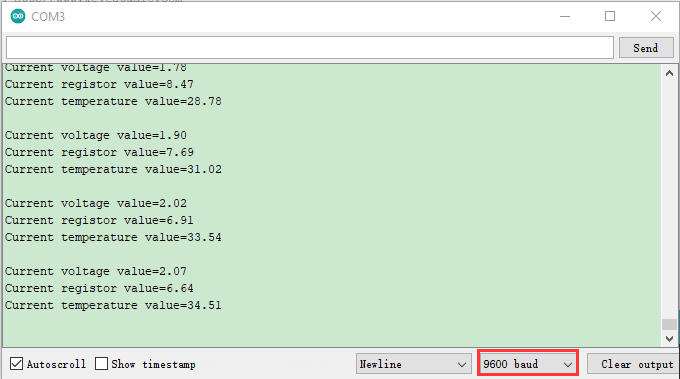

#### **5.Circuit Diagram and Wiring Diagram**

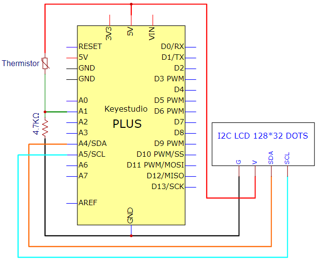


#### **6.Code**

Note: The “**LCD\_128X32**”library file needs to be installed in the code. If the library file has been added, ignore the process of adding the library file below.

Project 16 contains the library files of I2C 128×32 LCD. Decompress the library files in the folder, that is, put the decompressed “**LCD\_128X32**” folder into “Arduino libraries” under the compiler installation directory.

After successful placement, you need to restart the compiler, otherwise the compilation will not work.

e.g：C: \\Program Files\\Arduino\\libraries

```c
/*
Keyestudio 2021 starter learning kit
Project 30.2
Temperature_Instrument
http//www.keyestudio.com
*/
#include <math.h>
#include <lcd.h>  //add library files
lcd Lcd;  //define a Lcd class instance
const float voltagePower=5.0;
const float Rs_val=4.7;//sample resistance is 4.7KΩ 
const int B=3950;
const double T1=273.15+25;//normal temperature
const double R1=10;//ordinary temperature corresponds the resistance value, unit is KΩ
char string[10];

void setup(){
Serial.begin(9600);
Lcd.Init(); //initialize
Lcd.Clear();  //clear
}

void loop(){
// attain the voltage value at A1
double digitalValue=analogRead(1);
double voltageValue=(digitalValue/1023)*5;
  
//Obtain the resistance of the thermistor through the voltage divider ratio 
double Rt=((voltagePower-voltageValue)*Rs_val)/voltageValue;

//Converted to get the temperature value 
const float t=((T1*B)/(B+T1*log(Rt/R1)))-273.15;

if(t>-100.0) //If the temperature is greater than -100°C, the LCD display voltage value,obtains the resistance value of the thermistor through the voltage division ratio and temperature value 
{
Lcd.Cursor(0,0);
Lcd.Display("C v v=");
Lcd.Cursor(0,7);
Lcd.DisplayNum(voltageValue);
Lcd.Cursor(0, 10);
Lcd.Display("V");

Lcd.Cursor(1,0);
Lcd.Display("C r v=");
Lcd.Cursor(1,7);
Lcd.DisplayNum(Rt);
Lcd.Cursor(1, 10);
Lcd.Display("R");

Lcd.Cursor(2, 0);
Lcd.Display("C t v=");
Lcd.Cursor(2, 7);
Lcd.DisplayNum(t);
Lcd.Cursor(2, 10);
Lcd.Display("C");
}
delay(300);
}
```

#### **7.Result**

After uploading the code to the Plus Mainboard, connecting the wires and powering on, the LCD\_128X32\_DOT displays the voltage value of the corresponding A1 pin, obtain the resistance value of the thermistor through the voltage division ratio and the temperature value in the current environment .（Only integers can be displayed, not decimals on the LCD\_128X32\_DOT）

### **Project 31: Intelligent Access Control System**

####   **1.Introduction**

Nowadays, many residential districts use this function to open the door by swiping the card, which is very convenient. In this lesson, we will study the RFID-RC522 module that can open the door by swipe card.

####   **2.Components Required**

|                    | 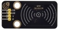 |  |  |
| ------------------------------------------------------------ | ------------------------------------------------------------ | ------------------------------------------------------------ | ------------------------------------------ |
| Keyestudio Plus Mainboard*1                                  | RFID-RC522 Module*1                                          | Servo*1                                                      | Key Chain*1                                |
|  |  |                    |                                            |
| F-F Dupont Wires                                             | USB Cable*1                                                  | Swipe Card*1                                                 |                                            |

####   **3.Component Knowledge**

**MF RC522 chip:** 

MF RC522 is a highly integrated card reader chip for 13.56MHz contactless communication. The MF RC522 utilizes advanced modulation and demodulation concepts to fully integrate all types of passive contactless communication methods and protocols at 13.56MHz. Supports 14443A compatible transponder signals. Digital section handles ISO14443A frames and error detection. 

In addition, the fast CRYPTO1 encryption algorithm is also supported. MFRC522 supports higher speed contactless communication of MIFARE series with bi-directional data transfer rate up to 424kbit/s. As a new member of the 13.56MHz highly integrated read and write card series chip family, MF RC522 has a lot of similarities to MF RC500 and MF RC530, and also has many features and differences. It uses SPI mode to communicate with the host , which is conducive to reducing cable, shrinking the size of the PCB board, and lowering the costs.

**RFID-RC522 module:** 

RF Identification (RFID) is a wireless communication technology that recognizes specific targets and reads and write related data over the radio signal. RFID-RC522 module adopts Philips MFRC522 original reader circuit chip design, easy to use, low cost, suitable for equipment development,development of advanced applications, the need for RF card terminal design or production. This module can be loaded directly into a variety of readers molds. 

The module adopts a voltage of 5V, through the I2C interface and a few wires can be directly connected to any CPU mainboards or microcontrollers for communication, which can ensure the module stable and reliable work. The modules are easy to use, highly reliable and small in size, helping customers to easily and quickly apply contactless cards to their systems.

**Specifications:**

- Operating voltage: DC 5V

- Operating current: 13mA to 100mA/DC 5V

- Idling current: 10-13mA/DC 5V

- Sleep current: <80uA

- Peak current: <100mA

- Operating frequency: 13.56MHz

- Maximum power: 0.5W

- Supported card types: mifare1 S50、mifare1 S70、mifare UltraLight、mifare Pro、mifare Desfire

- Environmental operating temperature: -20 to 80 degrees Celsius 
- Environment storage temperature: -40 to 85 degrees Celsius 
- Relative Humidity: 5% to 95%
- Data transfer rate: The maximum is 10Mbit/s.


####   **4.Read the Card Number Value**

We start by reading the card number values of the swipe card and key chain using a simple code , and print them in the serial monitor. The wiring diagram is as follows.


Note: The library files are required in the code. If you have already added the library files such as “**MFRC522\_I2C**” and “**Wire**”, you can ignore the process of adding library files.

Decompress the library files in the folder, that is, put the decompressed “**MFRC522\_I2C**” folder and “**Wire**” folder into “Arduino libraries” under the compiler installation directory.

After successful placement, you need to restart the compiler, otherwise the compilation will not work.

e.g：C: \\Program Files\\Arduino\\libraries

```c
/*
Keyestudio 2021 starter learning kit
Project 31.1
Read_the_door_card_number_value
http//www.keyestudio.com
*/
#include <Wire.h>
#include "MFRC522_I2C.h"

// 0x28 is the i2c address of SDA, if doesn't match，please check your address with i2c.
MFRC522 mfrc522(0x28);   // create MFRC522.

void setup() {
  Serial.begin(115200);           // initialize and PC's serial communication
  Wire.begin();                   // initialize I2C
  mfrc522.PCD_Init();             // initialize MFRC522
  ShowReaderDetails();            // dispaly PCD - MFRC522 read carder
  Serial.println(F("Scan PICC to see UID, type, and data blocks..."));
}

void loop() {
  // 
  if ( ! mfrc522.PICC_IsNewCardPresent() || ! mfrc522.PICC_ReadCardSerial() ) {
    delay(50);
    return;
  }
  
  // select one of door cards. UID and SAK are mfrc522.uid.
  
  // save UID
  Serial.print(F("Card UID:"));
  for (byte i = 0; i < mfrc522.uid.size; i++) {
    Serial.print(mfrc522.uid.uidByte[i] < 0x10 ? " 0" : " ");
    Serial.print(mfrc522.uid.uidByte[i], HEX);
  } 
  Serial.println();
}

void ShowReaderDetails() {
  //  attain the MFRC522 software
  byte v = mfrc522.PCD_ReadRegister(mfrc522.VersionReg);
  Serial.print(F("MFRC522 Software Version: 0x"));
  Serial.print(v, HEX);
  if (v == 0x91)
    Serial.print(F(" = v1.0"));
  else if (v == 0x92)
    Serial.print(F(" = v2.0"));
  else
    Serial.print(F(" (unknown)"));
  Serial.println("");
  // when returning to 0x00 or 0xFF, may fail to transmit communication signals
  if ((v == 0x00) || (v == 0xFF)) {
    Serial.println(F("WARNING: Communication failure, is the MFRC522 properly connected?"));
  }
}
```

Upload the code to the Plus mainboard, connect the wires and power on first. Then open the serial monitor, set the baud rate to 115200. The card number values of the swipe card and key chain can be read separately by bringing the door card and key chain near the sensing area of the module. As shown in the figure below.


#### **5.Circuit Diagram and Wiring diagram of RFID-RC522 Controlling Steering gear Rotation**

Now we use a RFID-RC522 module, swipe card and servo to simulate an intelligent access control system. When the swipe card is close to the RFID-RC522 module induction area, the servo rotates. Wiring according to the figure below.


#### **6.Code**

Note: The library files are required in the code. If you have already added the library files such as “**MFRC522\_I2C**”, “**Wire**” and “**Servo**”, you can ignore the process of adding library files.

Decompress the library files in the folder, that is, put the decompressed “**MFRC522\_I2C**” folder, “**Wire**” folder and “**Servo**” folder into “Arduino libraries” under the compiler installation directory.

After successful placement, you need to restart the compiler, otherwise the compilation will not work.

e.g：C: \\Program Files\\Arduino\\libraries

**Note: For different RFID-RC522 swipe cards, the values may be different. You can replace the corresponding swipe card values in the code program based on your own swipe card values, otherwise upload the code to the Plus Mainboard, which may cause RFID-RC522 module and swipe card fail to control the servo.**

**For example: You can use values which read from your own swipe cards to replace values in code**

```c
/*
Keyestudio 2021 starter learning kit
Project 31.2
Intelligent_access_control_system
http//www.keyestudio.com
*/
#include <Wire.h>
#include "MFRC522_I2C.h"
#include <Servo.h>
#define SERVO_PIN 9
#define USER_NUM 4

byte servoRun = 0;
byte userCard[USER_NUM][4] = {  // card storage array
  {28,   184,  119,  33},
  {147,  173,  247,  32},
  {57,  182,  70,  194}
};

// 0x28 is i2c address on SDA. Check your address with i2cscanner if not match.
// MFRC522 mfrc522(0x28, RST_PIN);   // Create MFRC522 instance.
MFRC522 mfrc522(0x28);   // Create MFRC522 instance.
 
void setup() { 
  Serial.begin(115200);           // Initialize serial communications with the PC
  Wire.begin();                   // Initialize I2C
  mfrc522.PCD_Init();              // Initialize MFRC522 
  pinMode(SERVO_PIN, OUTPUT);   // servo controld the port
}
 
void loop() {
  if(servoRun == 1){            // If the servo running variable is 1, it will run. 
    servoControl();             // the function to ocntrol the servo
  }
  
  if ( ! mfrc522.PICC_IsNewCardPresent()) return;       // find cards
  if ( ! mfrc522.PICC_ReadCardSerial())   return;       // 验证NUID是否可读
  MFRC522::PICC_Type piccType = mfrc522.PICC_GetType(mfrc522.uid.sak);
  if (piccType != MFRC522::PICC_TYPE_MIFARE_MINI &&  // check MIFARE type
    piccType != MFRC522::PICC_TYPE_MIFARE_1K &&
    piccType != MFRC522::PICC_TYPE_MIFARE_4K) {
    Serial.println("Can identify this card!");
    return;
  }
  
  byte i;
  for (i=0; i<USER_NUM;  i++){    // 
    byte i2;
    for(i2=0;  i2<4; i2++){       // 
      if(mfrc522.uid.uidByte[i2] != userCard[i][i2]) break;  // when it is break，this card is not verified
    }
    if(i2 == 4){                  // when i2 is 4，which indicates that the four-digit value of this card has been verified. 
      Serial.println("Find an accessful card.");  // output the successful information
      servoRun = 1;               // set the variable of opening the door to 1
      break;                      // find the pass card, exit the loop.
    }
  }
  if(i==USER_NUM){                // If i is equal to the number of users, the upper loop does not find the pass card. 
    Serial.print("Find a unknown card, its uid:");
    for(i=0;  i<4;  i++){         // output UID
      Serial.print(mfrc522.uid.uidByte[i], DEC);
      Serial.print(" ");
    }
    Serial.println();
  }
  
  mfrc522.PICC_HaltA();              // Make the IC card placed in the card reading area enter the dormant state, no longer repeat the card reading 
  mfrc522.PCD_StopCrypto1();         // stop to code the card-reading module

}


void servoControl(){              // servo controls functions
  Serial.println("Servo run!");   // output sign to output the function
  servoPulse(0);                  // servo rotate to 0°
  delay(500);                    // wait the servo to rotate
  servoPulse(180);                // servo rotate to 180°
  servoRun = 0;                   // set the variable of running the servo to 0
}

void servoPulse(int myangle)      //Define an impulse function 
{
  int pulseWidth=(myangle*11)+500;// convert the angle to the pulse width of 500-2480
  digitalWrite(SERVO_PIN,HIGH);   //  set the port of the servo to high
  delayMicroseconds(pulseWidth);  // delay the time of the pulse width
  digitalWrite(SERVO_PIN,LOW);    // set the port of the servo to low
  delay(20-pulseWidth/1000);
}
```

#### **7.Result**

Upload the code to the Plus Mainboard, connect the wires and power on first. Then open the serial monitor, after bringing the swipe card close to the RFID-RC522 module induction area 2 or 3 times, the servo turns once. At the same time, "Find an accessful card. Servo run!" appears 2 or 3 times on the serial monitor.


### **Project 32: Control the LED with 4x4 Matrix Keyboard**

####   **1.Introduction**

Matrix keypads are the kind of keypads you see on cell phones, calculators, microwaves ovens, door locks, etc. They’re practically everywhere.

However, in DIY electronics, they are a great way to let users interact with your project and are often needed to navigate menus, punch in passwords and control robots.

####   **2.Components Required**

|  |  |  |  |
| ------------------------------------------ | ------------------------------------------------------------ | ------------------------------------------------------------ | ------------------------------------------------------------ |
| Keyestudio Plus Mainboard*1                | 4\*4 Membrane Matrix Keyboard*1                              | USB Cable*1                                                  | Jumper Wires                                                 |

#### **3.Component Knowledge**

**4*4 Matrix keyboard:**

The keyboard is a device that integrates many keys. As shown in the figure below, a 4x4 keyboard integrates 16 keys.


As with the LED matrix integration, in the 4x4 keyboard, each row of keys is connected to a pin, each column of keys is the same. This connection reduces the use of processor ports. The internal circuit is shown below.


You can use row scan or column scan methods to detect the state of the keys on each column or each line. Take the column scan method as an example. Send a low level to column 4 (Pin4), detect the state of rows 1, 2, 3 and 4, and determine whether the A, B, C and D keys are pressed. Then send the low level to columns 3, 2, 1 in turn, and detect whether other keys are pressed. Then you can get the state of all keys.

#### **4.Read the Value**

We start with a simple code to read the values of the 4\*4 matrix keyboard and print them in the serial monitor. Its wiring diagram is shown below.


**Install the Keypad Library:**

We will use the Keypad library in all the following code examples.

Note: The library files are required in the code. If you have already added the “**Keypad**” library files, ignore the process of adding the library file below.

Decompress the library files in the folder, that is, put the decompressed “**Keypad**” folder into “Arduino libraries” under the compiler installation directory.

After successful placement, you need to restart the compiler, otherwise the compilation will not work.

e.g：C: \\Program Files\\Arduino\\libraries

```c
/*
Keyestudio 2021 starter learning kit
Project 32.1
4x4_Keypad_display
http//www.keyestudio.com
*/
#include <Keypad.h>
const byte ROWS = 4; // define the row 4
const byte COLS = 4; // define the row 4 
char keys[ROWS][COLS] = {
{'1','2','3','A'},
{'4','5','6','B'},
{'7','8','9','C'},
{'*','0','#','D'}
};
//  connect the port of 4*4 keypad to the corresponding digital port of the control board
byte rowPins[ROWS] = {2,3,4,5};
// connect the port of 4*4 keypad to the corresponding digital port of the control board
byte colPins[COLS] = {6,7,8,9};
// call on the corresponding functions from libraries
Keypad keypad = Keypad( makeKeymap(keys), rowPins, colPins, ROWS, COLS );
void setup(){
Serial.begin(9600);
}
void loop(){
char key = keypad.getKey();
if (key != NO_KEY){
Serial.println(key);
}
}
```

Upload the code to the Plus mainboard, wire up and power on first. Then open the serial monitor, press the button of the 4\*4 matrix keyboard to read the corresponding values in the open serial monitor.

The monitor will show the corresponding key values as you press keys on the keypad.

[](mediamedia/5883416c9c11a348576c9d1b38c3d6fd.png)

#### **5\. Test Code**

Use the above connection diagram. Now we use the 4 \* 4 matrix keyboard to control the LED on the pin 13 of the Mainboard.

```c
/*
Keyestudio 2021 starter learning kit
Project 32.2
Control the LED with 4x4 Matrix Keyboard
http//www.keyestudio.com
*/
#include <Keypad.h>
const byte ROWS = 4;  // define row 4
const byte COLS = 4;  // define row 4
char keys[ROWS][COLS] = {
  { '1', '2', '3', 'A' },
  { '4', '5', '6', 'B' },
  { '7', '8', '9', 'C' },
  { '*', '0', '#', 'D' }
};
// connect the port of 4*4 keypad to the corresponding digital port of the control board
byte rowPins[ROWS] = { 2, 3, 4, 5 };
// connect the port of 4*4 keypad to the corresponding digital port of the control board
byte colPins[COLS] = { 6, 7, 8, 9 };
Keypad keypad = Keypad(makeKeymap(keys), rowPins, colPins, ROWS, COLS);
byte ledPin = 13;
boolean blink = false;
void setup() {
  Serial.begin(9600);
  pinMode(ledPin, OUTPUT);               // set the digital pins to OUTPUT
  digitalWrite(ledPin, HIGH);            // set LED to light up
  keypad.addEventListener(keypadEvent);  //add EventListener to the keyboard
}
void loop() {
  char key = keypad.getKey();
  if (key != NO_KEY) {
    Serial.println(key);
  }
  if (blink) {
    digitalWrite(ledPin, !digitalRead(ledPin));
    delay(100);
  }
}
//
void keypadEvent(KeypadEvent key) {
  switch (keypad.getState()) {
    case PRESSED:
      switch (key) {
        case '#': digitalWrite(ledPin, !digitalRead(ledPin)); break;
        case '*':
          digitalWrite(ledPin, !digitalRead(ledPin));
          break;
      }
      break;
    case RELEASED:
      switch (key) {
        case '*':
          digitalWrite(ledPin, !digitalRead(ledPin));
          blink = false;
          break;
      }
      break;
    case HOLD:
      switch (key) {
        case '*': blink = true; break;
      }
      break;
  }
}
```

**Note:** Add the“Keypad”library folder we provided in the corresponding folder to the installation directory Arduino compiler library, otherwise the compilation will not work.

#### **6.Result**

Upload the code to the Plus mainboard, wire up and power on first.

The key \* and # on the keypad can control the on and off of the LED connected to pin 13 on the PLUS board.

Yet, if you hold the key \*, the LED connected to pin 13 will flash.

### **Project 33: WiFi Test**

#### **1.Introduction**

ESP8266 serial WiFi ESP-01 module is an ultra-low-power UART-WiFi transparent transmission module and designed for mobile devices and IoT applications. The physical device of the user can be connected to Wi-Fi wireless network for Internet or LAN communication to realize networking functions.

#### **2.Components Required**

|  |  |
| ------------------------------------------ | ------------------------------------------------------------ |
| ESP8266 Serial WiFi ESP-01 Module*1        | USB to ESP-01S WiFi Module Serial Shield*1                   |

#### **3.Component Knowledge**


**USB to ESP-01S WiFi module serial shield:**

It is suitable for the ESP-01S WiFi module. Turn the DIP switch on the USB to ESP-01S WiFi module serial shield to Flash Boot, and plug into computer’s USB port. You can use serial debugging tool to test the AT command.

Turn the DIP switch on the USB to ESP-01S WiFi module serial shield to the UartDownload, ESP-01 module is at download mode. You can download the firmware to ESP-01 module using AT firmware.


**ESP8266 serial WiFi ESP-01:** 

ESP8266 serial WiFi ESP-01 is an ultra-low-power UART-WiFi transparent transmission module. It can be widely used in smart grids, intelligent transportation, smart furniture, handheld devices, industrial control and other fields.

##### **1).Features**

\*\* Supports wireless 802.11 b/g/n standards

\*\* Supports STA/AP/STA+AP three modes of operation

\*\* Built-in TCP/IP protocol stack to support multi-channel TCP Client connections

\*\* Supports many Socket AT commands

\*\* Supports UART / GPIO data communication interface

\*\* Supports Smart Link smart networking function

\*\* Supports remote firmware upgrades(OTA)

\*\* Built-in 32-bit MCU, can also be used as an application processor

\*\* Ultra-low-power and highly integrated Wi-Fi chip for battery-powered applications

\*\* Working temperature range: -40 ° C to + 125 ° C

\*\* 3.3V single power supply

##### **2).Parameters**


##### **3).About the Hardware**

ESP8266 has many hardware interfaces, supporting UART, IIC, PWM, GPIO, ADC, etc., and suitable for a variety of IoT applications.

| **PIN** | **Function** | **Description** |
| --- | --- | --- |
| 1 | URXD | UART\_RXD, receive General Purpose Input/Output：GPIO3 |
| 2 | UTXD | UART\_TXD, send 2）General Purpose Input/Ou tput: GPIO1 3）Do not pull down when power on |
| 5 | RESET（GPIO 16） | External Reset signal, LOW reset, HIGH works(default is HIGH) |
| 6 | GND | GND |
| 8 | VCC | 3.3V, power the module |
| 9 | ANT | WiFi Antenna |
| 11 | GPIO0 | WiFi Status(Default)：WiFi status indicator control signal Working mode selection: Suspend：Flash Boot，working mode Pull down：UART Download，download mode |
| 12 | ADC | ADC, input range: 0V-1V |
| 13 | GPIO15 | Pull down：work mode |
| 14 | CH\_PD | Working at HIGH level Power off at LOW level |
| 15 | GPIO2 | It must be HIGH level when power on, do not pull down the hardware Internal is pulled up(default) |

##### **4).Power consumption**

The above power consumption data is based on a 3.3V power supply at 25°ambient temperature.

A. All measurements are completed at the antenna interface.

B. All transmitted data is based on 90% duty cycle, which is measured in a continuous launch mode.

| Modes                                        | Min  | Typ  | Max  | Unit |
| -------------------------------------------- | ---- | ---- | ---- | ---- |
| Tx 802.11b, CCK 1Mbps, Pout=+19.5dBm         | /    | 215  | /    | mA   |
| Tx 802.11b, CCK 11Mbps, Pout=+18.5dBm        | /    | 197  | /    | mA   |
| Tx 802.11g, OFDM54 Mbps, Pout=+16dBm         | /    | 145  | /    | mA   |
| Tx 802.11n, MCS7, Pout=+14dBm                | /    | 135  | /    | mA   |
| Rx 802.11b, 1024 bytes packet length, -80dBm | /    | 100  | /    | mA   |
| Rx 802.11g, 1024 bytes packet length, -70dBm | /    | 100  | /    | mA   |
| Rx 802.11n, 1024 bytes packet length, -65dBm | /    | 102  | /    | mA   |
| Standby Mode                                 | /    | 70   | /    | mA   |
| Power Off                                    | /    | 0.5  | /    | μA   |

##### **5).Radio characteristic**


The following data were measured when the voltage is 3.3V at room temperature.

| **Description** | **Min** | **Typ** | **Max** | **Unit** |
| --- | --- | --- | --- | --- |
| Input frequency | 2412 | / | 2484 | MHz |
| Input resistance | / | 50 | / | Ω |
| Input reflection | / | / | \-10 | dB |
| PA output power at 72.2 Mbps | 14 | 15 | 16 | dBm |
| PA output power in 802.11b mode | 17.5 | 18.5 | 19.5 | dBm |
| **Sensitivity** |  |  |  |  |
| CCK 1Mbps | / | \-98 | / | dBm |
| CCK 11Mbps | / | \-91 | / | dBm |
| 6Mbps(1/2BPSK) | / | \-93 | / | dBm |
| 54Mbps(3/4 64-QAM) | / | \-75 | / | dBm |
| HT20，MCS7（65Mbps，72.2Mbps） | / | \-71 | / | dBm |
| **Adjacent channel rejection** |  |  |  |  |
| OFDM，6Mbps | / | 37 | / | dB |
| OFDM，54Mbps | / | 21 | / | dB |
| HT20，MCS0 | / | 37 | / | dB |
| HT20，MCS7 | / | 20 | / | dB |

Note: 

A.  72.2Mbps is measured in 802.11n mode with MCS equal to 7 and GI equal to 200uS.

B\.  Up to +19.5dBm output power in 802.11b mode.

##### **6).Functions**

###### **A. Main functions**

The main functions that can be achieved by ESP8266 include: serial port transparent transmission , PWM regulation, GPIO control.

※Serial port transparent transmission: The transmission is reliable with a maximum transmission rate of 460800bps.

※PWM regulation: Adjusting lights and tricolor LED, motor speed control, etc.

※GPIO control: Control switch, relay, etc.

###### **B. Working modes**

The ESP8266 module supports three operating modes, STA/AP/STA+AP.

❊STA mode: The ESP8266 module can access to the Internet through a router, so the mobile phone or computer can remotely control the device through the Internet.


❊AP mode: The ESP8266 module acts as a hotspot to enable communication directly with the mobile phone or computer to achieve wireless control of the local area network (LAN).

❊STA+AP mode: The coexistence mode of the above two modes, that is, can achieve the seamless switching through the Internet control, more convenient for operation.

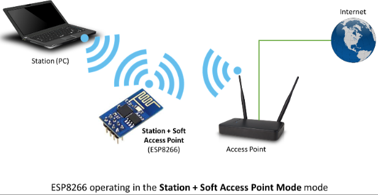

###### **C. Applications**

✭✮Serial CH340 to Wi-Fi

✭✮Industrial transparent transmission DTU

✭✮Wi-Fi remote monitoring/control

✭✮Toy field

✭✮Color LED control

✭✮Integrated management of fire protection and security intelligence

✭✮Smart card terminals, wireless POS machines, Wi-Fi cameras, handheld devices, etc

#### **4.Install the Driver**

The USB to serial port chip of this shield is CH340, We need to install the chip driver. The driver is usb\_ch341\_3.1.2009.06. We put this driver on the D: drive (i.e.: copyto D: drive). Then start installing the driver. The way to install drivers in different systems is pretty much the same, we will start installing drivers on the Windows 10.

A. When you connect the shield to your computer at the first time, right click“Computer”—>“Properties”—>“Device manager”, you can see“**USB-Serial**”.


B. Click“**USB-Serial**”and select“**Update Driver** ”.


C. Then click on "**Browse my computer for drivers**".


D. Find the "**Drive File**" folder provided.(Here I put the driver file USb\_CH341\_3.1.2009.06 on disk D)

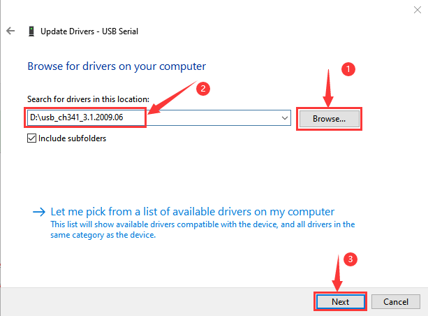

E. Click "**Close**" when installation is complete.


F. After the driver installation is complete, right click“Computer”—>“Properties”—>“Device manager”, you can see that the CH340 driver has been successfully installed on your computer, as follows.


#### **5.Interface the Shield with the Computer**

A. Insert the ESP8266 serial WiFi ESP-01 module in the correct orientation into the USB to ESP-01S WiFi module serial shield.


B. First, turn the DIP switch on the USB to ESP-01S WiFi module serial shield to the UartDownload, and then insert the shield into the USB port of the computer.


#### **6.Set up the Development Environment**

Insert the ESP8266 serial WiFi ESP-01 module into the USB to ESP-01S WiFi module serial shield correctly, and then plug the shield into the USB port of the computer. Click to enter the arduino-1.8.16 folder (you can also use the latest version). Find and click to enter the 1.8.16 version of the IDE interface.


##### **(1) Download and install from the Arduino IDE**

A. Click **File** →**Preferences**, copy and paste this address ([http://arduino.esp8266.com/stable/package\_esp8266com\_index.json](http://arduino.esp8266.com/stable/package_esp8266com_index.json)) in the ”**Additional Boards Manager URLs:**”, then click "**OK**" to save this address.


B. Click“**Tools**”→“**Board:**”, then click on "**Board Manager...**" to enter the "**Board Manager**" page, type "ESP8266" in the space after "All". Then click the following search content, select the latest version to install. The installation package is not large, click "**Install**" to start to install the relevant plug-ins. 

(There may be an error in downloading and installing, possibly due to the server, so you need to click "Install" again. However, due to network reasons, most users may not be able to search esp8266 by esp8266 Community, so this method is not recommended for beginners, and **the following method 2 is recommended**.)

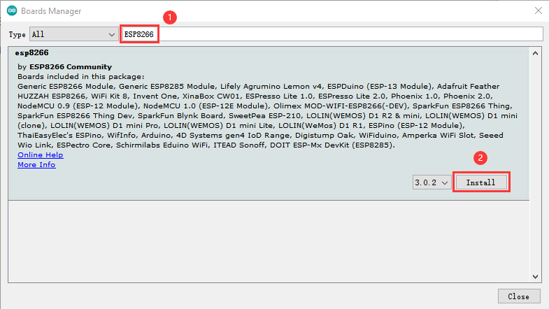

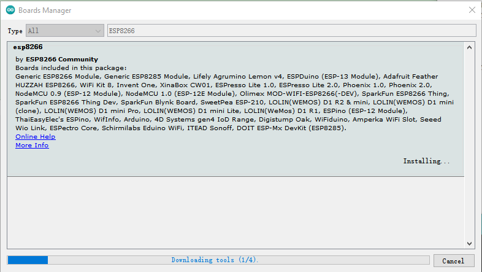

C. After successful installation, Click“**Close**”to close the page, and then click“**Tools**”→“**Board:**”, you can view different models of ESP8266 development boards in it. Select the corresponding ESP8266 development board model and COM port to program ESP8266.


##### **(2) Installation of ESP8266 by tools (Recommended)**

Use“ESP8266 one-click installation of Arduino board version 2.5.0.exe”to install ESP8266. This method is recommended because it is convenient and fast.


A. Double click“ESP8266 one-click installation of Arduino board version 2.5.0.exe”, then the installation is finished.


B. After the above tool is installed, restart the Arduino IDE software and click on the Arduino menu bar\*\*“Tools”→“Board:”\*\* , you can view different models of ESP8266 development boards in it. Select the corresponding ESP8266 development board model and COM port to program ESP8266.


#### **7.WiFi Test Code**

Note: After opening the IDE, set the board type and COM port first. If you don't have WiFi at home, you can turn your phone hotspot on to share WiFi.

```C
/*
Keyestudio 2021 starter learning kit
Project 33
WIFI test
http//www.keyestudio.com 
*/
#include <ESP8266WiFi.h>
#include <ESP8266mDNS.h>
#include <WiFiClient.h>

#ifndef STASSID
//#define STASSID "your-ssid"
//#define STAPSK  "your-password"
#define STASSID "ChinaNet-2.4G-0DF0"  //the name of user's wifi
#define STAPSK "ChinaNet@233"         //the password of user's wifi
#endif

const char* ssid = STASSID;
const char* password = STAPSK;

// TCP server at port 80 will response the HTTP requirement
WiFiServer server(80);

void setup(void) {
  Serial.begin(115200);

  //  connect WiFi
  WiFi.mode(WIFI_STA);
  WiFi.begin(ssid, password);
  Serial.println("");

  // wait connection
  while (WiFi.status() != WL_CONNECTED) {
    delay(500);
    Serial.print(".");
  }
  Serial.println("");
  Serial.print("Connected to ");
  Serial.println(ssid);
  Serial.print("IP address: ");
  Serial.println(WiFi.localIP());

  // set the mDNS responder::
  // - in this example. the first parameter is domain name
  //   The fully qualified domain name is “esp8266.local”
  // - the second parameter is IP address
  //   send the IP address via WiFi
  if (!MDNS.begin("esp8266")) {
    Serial.println("Error setting up MDNS responder!");
    while (1) {
      delay(1000);
    }
  }
  Serial.println("mDNS responder started");

  // activate TCP (HTTP) server
  server.begin();
  Serial.println("TCP server started");

  // add the server to MDNS-SD
  MDNS.addService("http", "tcp", 80);
}

void loop(void) {

  MDNS.update();

  // check the client side is connected or not
  WiFiClient client = server.available();
  if (!client) {
    return;
  }
  Serial.println("");
  Serial.println("New client");

  // wait the effective data from the client side
  while (client.connected() && !client.available()) {
    delay(1);
  }

  // read the first row of HTTP requirement
  String req = client.readStringUntil('\r');

  // the first row of the HTTP requirement is shown below: "GET /path HTTP/1.1"
  // Retrieve the "/path" part by finding the spaces
  int addr_start = req.indexOf(' ');
  int addr_end = req.indexOf(' ', addr_start + 1);
  if (addr_start == -1 || addr_end == -1) {
    Serial.print("Invalid request: ");
    Serial.println(req);
    return;
  }
  req = req.substring(addr_start + 1, addr_end);
  Serial.print("Request: ");
  Serial.println(req);
  client.flush();

  String s;
  if (req == "/") {
    IPAddress ip = WiFi.localIP();
    String ipStr = String(ip[0]) + '.' + String(ip[1]) + '.' + String(ip[2]) + '.' + String(ip[3]);
    s = "HTTP/1.1 200 OK\r\nContent-Type: text/html\r\n\r\n<!DOCTYPE HTML>\r\n<html>Hello from ESP8266 at ";
    s += ipStr;
    s += "</html>\r\n\r\n";
    Serial.println("Sending 200");
  } else {
    s = "HTTP/1.1 404 Not Found\r\n\r\n";
    Serial.println("Sending 404");
  }
  client.print(s);

  Serial.println("Done with client");
}
```

#### **8.Result**

Note: You need to change the user WiFi name and user WiFi password in the project code to your own WiFi name and WiFi password.


Next, turn the DIP switch of the shield to the UartDownload end and interface the shield to the USB port of a computer.

Then set the board type and COM port.

The corresponding board type and COM port are displayed in the lower right corner of the IDE. Click  to upload the test code to the ESP8266 serial WiFi ESP-01 module, the upload is complete.（Note: If uploading unsuccessfully, reconnect the shield to the computer)


After the test code is uploaded successfully, first unplug the shield from the USB port of the computer, then turn DIP switch on the shield to the Flash Boot , and interface the shield to your PC. Open the serial monitor, set the baud rate to **115200**, and you can see your WiFi information, as shown below.


### **Project 34: WiFi Control LED**

#### **1.Introduction**

In this project, we will use the ESP8266 serial WiFi ESP-01 module to control the LED on the Plus control board through APP

#### **2.Components Required**

|                    |                    |  |
| ------------------------------------------------------------ | ------------------------------------------------------------ | ------------------------------------------------------------ |
| Keyestudio Plus Mainboard*1                                  | USB to ESP-01S WiFi Module Serial Shield*1                   | M-F Dupont Wires                                             |
|  |  |  |
| ESP8266 Serial WiFi ESP-01 Module*1                          | Smartphone/IPad*1                                            | USB Cable*1                                                  |

#### **3.Plug the Shield into the USB port of the computer**

  A. Insert the ESP8266 serial WiFi ESP-01 module into the USB to ESP-01S WiFi shield.


 B. First, turn the DIP switch on the USB to ESP-01S WiFi module serial shield to the UartDownload, and then insert the shield into the USB port of the computer.


#### **4.ESP8266 Code**

```C
/*
Keyestudio 2021 starter learning kit
Project 34.1
ESP8266_Code
http//www.keyestudio.com 
*/
// generated by KidsBlock
#include <Arduino.h>
#include <ESP8266WiFi.h>
#include <ESP8266mDNS.h>
#include <WiFiClient.h>

#ifndef STASSID
#define STASSID "ChinaNet-2.4G-0DF0"  //the name of user's Wifi
#define STAPSK  "ChinaNet@233"        //the password of the user's wifi
#endif
const char* ssid = STASSID;
const char* password = STAPSK;
WiFiServer server(80);
String unoData = "";
int ip_flag = 0;
int ultra_state = 1;
String ip_str;


void setup() {
  Serial.begin(9600); 
  WiFi.mode(WIFI_STA);
  WiFi.begin(ssid, password);
  while (WiFi.status() != WL_CONNECTED) {
    delay(500);
    Serial.print(".");
  }
  Serial.print("IP ADDRESS: ");
  Serial.println(WiFi.localIP());
  if (!MDNS.begin("esp8266")) {
    //Serial.println("Error setting up MDNS responder!");
    while (1) {
      delay(1000);
    }
  }
 // Serial.println("mDNS responder started");
  server.begin();
  //Serial.println("TCP server started");
  MDNS.addService("http", "tcp", 80);
  ip_flag = 1;
  

}

void loop() {
  if(ip_flag == 1)
  {
    Serial.print("IP: ");
    Serial.println(WiFi.localIP());
    //Serial.print('#');
    delay(100);
  }
    MDNS.update();
    WiFiClient client = server.available();
    if (!client) {
      return;
    }
    //Serial.println("");
    while (client.connected() && !client.available()) {
      delay(1);
    }
    String req = client.readStringUntil('\r');
    int addr_start = req.indexOf(' ');
    int addr_end = req.indexOf(' ', addr_start + 1);
    if (addr_start == -1 || addr_end == -1) {
      //Serial.print("Invalid request: ");
      //Serial.println(req);
      return;
    }
    req = req.substring(addr_start + 1, addr_end);
    client.flush();
    String s;
    if (req == "/") {
      IPAddress ip = WiFi.localIP();
      String ipStr = String(ip[0]) + '.' + String(ip[1]) + '.' + String(ip[2]) + '.' + String(ip[3]);
      s = "HTTP/1.1 200 OK\r\nContent-Type: text/html\r\n\r\n<!DOCTYPE HTML>\r\n<html>Hello from ESP8266 at ";
      s += ipStr;
      s += "</html>\r\n\r\n";
      //Serial.println("Sending 200");
      Serial.println(WiFi.localIP());
      Serial.write('*');
      client.println(WiFi.localIP());
      ip_flag = 0;
    }
    else if(req == "/btn/0")
    {
      Serial.write('a');
      client.println("turn on the relay");
    }
    else if(req == "/btn/1")
    {
      Serial.write('b');
      client.println("turn off the relay");
    }
    else if(req == "/btn/2")
    {
      Serial.write('c');
      client.println("Bring the steering gear over 180 degrees");
    }
    else if(req == "/btn/3")
    {
      Serial.write('d');
      client.println("Bring the steering gear over 0 degrees");
    }
    else if(req == "/btn/4")
    {
      Serial.write('e');
      client.println("esp8266 already turn on the fans");
    }
    else if(req == "/btn/5")
    {
      Serial.write('f');
      client.println("esp8266 already turn off the fans");
    }
    else if(req == "/btn/6")
    {
      Serial.write('g');
      while(Serial.available() > 0)
      {
        unoData = Serial.readStringUntil('#');
        client.println(unoData);
      }
    }
    else if(req == "/btn/7")
    {
      Serial.write('h');
      client.println("turn off the ultrasonic");
    }
    else if(req == "/btn/8")
    {
      Serial.write('i');
      while(Serial.available() > 0)
      {
        unoData = Serial.readStringUntil('#');
        client.println(unoData);
        //client.flush();
      }
    }
    else if(req == "/btn/9")
    {
      Serial.write('j');
      client.println("turn off the temperature");
    }
    else if(req == "/btn/10")
    {
      Serial.write('k');
      while(Serial.available() > 0)
      {
        unoData = Serial.readStringUntil('#');
        client.println(unoData);
        //client.flush();
      }
    }
    else if(req == "/btn/11")
    {
      Serial.write('l');
      client.println("turn off the humidity");
    }
    else if(req == "/btn/12")
    {
      Serial.write('m');
      client.println(F("m"));
    }
    else if(req == "/btn/13")
    {
      Serial.write('n');
      client.println(F("n"));
    }
    else if(req == "/btn/14")
    {
      Serial.write('o');
      client.println(F("o"));
    }
    else if(req == "/btn/15")
    {
      Serial.write('p');
      client.println(F("p"));
    }
    else if(req == "/btn/16")
    {
      Serial.write('q');
      client.println(F("q"));
    }
    else if(req == "/btn/17")
    {
      Serial.write('r');
      client.println(F("r"));
    }
    else if(req == "/btn/18")
    {
      Serial.write('s');
      client.println(F("s"));
    }
    else if(req == "/btn/19")
    {
      Serial.write('t');
      client.println(F("t"));
    }
    else if(req == "/btn/20")
    {
      Serial.write('u');
      client.println(F("u"));
    }
    else if(req == "/btn/21")
    {
      Serial.write('v');
      client.println(F("v"));
    }
    else if(req == "/btn/22")
    {
      Serial.write('w');
      client.println(F("w"));
    }
    else if(req == "/btn/23")
    {
      Serial.write('x');
      client.println(F("x"));
    }
    else {
      //s = "HTTP/1.1 404 Not Found\r\n\r\n";
      //Serial.println("Sending 404");
    }

    client.print(F("IP : "));
    client.println(WiFi.localIP());
}
```

Note: You need to change the user WiFi name and user WiFi password into your own WiFi name and WiFi password in the code


After changing the WiFi name and WiFi password, ensure that the DIP switch on the shield has been turned to the UartDownload and the shield has been plugged into the computer. Then set the board type and COM port according to the method in **Project 33**, and the corresponding board type and COM port are displayed in the lower right corner of the IDE. Click  to upload the test code to the ESP8266 serial WiFi ESP-01 module, the upload is complete.（Note: If the upload fails, unplug the shield and plug it into the computer's USB port again when the board type and COM port are OK.)


After the test code is uploaded successfully, first unplug the shield from the USB port of the computer, and then unplug the ESP8266 serial WiFi ESP-01 module from the shield.

#### **5.Wiring Diagram**


#### **6.Project Code**

Note: After opening the IDE, be sure to set the board type and COM port first. If you don't have WiFi at home, you need to turn your phone hotspot on to share WiFi.

```C
/*
Keyestudio 2021 starter learning kit
Project 34.2
WIFI control LED
http//www.keyestudio.com 
*/
const int ledPin = 13;
char wifiData;

void setup() {
  Serial.begin(9600);
  pinMode(ledPin, OUTPUT);
}

void loop() {
  if(Serial.available() > 0)
  {
    wifiData = Serial.read();
    Serial.print(wifiData);
    if(wifiData == '#')
    {
      Serial.println("");
    }
    delay(100);
    
    if(wifiData == 'a')
    {
      digitalWrite(ledPin, HIGH);
    }
    else if(wifiData == 'b')
    {
      digitalWrite(ledPin, LOW);
    }
  }
}
```

**7\. Result**

Note: Before uploading the project code, you need to unplug the TX and RX cables connected to the Plus control board first, otherwise the code will not be uploaded successfully.

 **Then click "Tools" → "Board:", select the Arduino UNO board and choose the correct COM port.** Finally, upload the project code to the Plus Mainboard. After uploading the code successfully, connect the other end of the TX Dupont wire on the ESP8266 serial WiFi ESP-01 module to the RX(0) pin on the Plus Mainboard. The other end of RX Dupont wire is connected to the TX (1) pin on the PLUS Mainboard. Click to open the serial monitor window and set the baud rate to 9600. In this way, the serial monitor shows the IP address of your WiFi. 

(==The IP address of WiFi sometimes changes. If the original IP address does not work, you need to detect the IP address again.==)


**App for Android system devices(mobile phone/iPad)**

Now transfer the “keyes wifi.apk” file from the folder to your Android phone or iPad, click the “keyes wifi.apk” file to enter the installation page. Click the "ALLOW" button, and then click the "**INSTALL**" button. Click the "**OPEN**" button to enter the APP interface after the installation is completed.


Enter the detected WiFi IP address in the text box in front of the WiFi button (For example, the IP address detected by the serial monitor above is 192.168.1.123), then click the WiFi button, "Webpage not available" will become "192.168.1.123".This shows that the App has been connected to WiFi.


**iOS system**

Open App Store.


Enter “keyes wifi” in the search box, search and the download page will appear. Click “”, you can download and install keyes wifi APP. The following operations are similar to those of Android system. You can refer to the steps of Android system above for operation.

Note: Click the button on APP, the blue light on ESP8266 serial WiFi ESP-01 module will flash, indicating that APP has connected to WiFi.

After the APP has been connected to the WiFi, start the following operations：

Click the button on the APP, the serial monitor prints some corresponding control characters, as shown below：


Click  ,the LED on the Plus Mainboard lights up. Click again, the LED on the Plus Mainboard goes out.

### **Project 35: WIFI Smart Home**                         

#### **1.Introduction**

In the previous project 34, we already knew how to connect the APP to WiFi and also use the APP to control the LED on and off on the Plus control board through WiFi for a simple experiment.

In this project, we will use APP to control multiple sensors or modules through WiFi to achieve the effect of smart home.

#### **2.Components Required**

|                    |   | 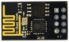  |   |
| ------------------------------------------------------------ | ------------------------------------------- | ------------------------------------------- | ------------------------------------------- |
| Keyestudio Plus Mainboard*1                                  | USB to ESP-01S WiFi Module Serial Shield*1  | ESP8266 Serial WiFi ESP-01 Module*1         | Temperature and Humidity Sensor*1           |
|                    |                     |   |   |
| 130 DC Motor Module*1                                        | Ultrasonic Sensor*1                         | 5V Relay Module*1                           | Servo*1                                     |
|  |  |  |  |
| Mobile Phone/iPad*1                                          | F-F Dupont Wires                            | M-F Dupont Wires                            | USB Cable*1                                 |

#### **3.Plug the WiFi Module Serial Shield into the USB port of the computer**

 A.  Insert the ESP8266 serial WiFi ESP-01 module into the USB to ESP-01S WiFi module serial shield.


B.  First, turn the DIP switch on the USB to ESP-01S WiFi module serial shield to the UartDownload, and then insert the shield into the USB port of the computer.


#### **4.ESP8266 Code**

```C
/*
Keyestudio 2021 starter learning kit
Project 35.1
ESP8266_Code
http//www.keyestudio.com 
*/
// generated by KidsBlock
#include <Arduino.h>
#include <ESP8266WiFi.h>
#include <ESP8266mDNS.h>
#include <WiFiClient.h>

#ifndef STASSID
#define STASSID "ChinaNet-2.4G-0DF0"  // the name of user's wifi
#define STAPSK  "ChinaNet@233"        //the password of user's wifi
#endif
const char* ssid = STASSID;
const char* password = STAPSK;
WiFiServer server(80);
String unoData = "";
int ip_flag = 0;
int ultra_state = 1;
String ip_str;


void setup() {
  Serial.begin(9600); 
  WiFi.mode(WIFI_STA);
  WiFi.begin(ssid, password);
  while (WiFi.status() != WL_CONNECTED) {
    delay(500);
    Serial.print(".");
  }
  Serial.print("IP ADDRESS: ");
  Serial.println(WiFi.localIP());
  if (!MDNS.begin("esp8266")) {
    //Serial.println("Error setting up MDNS responder!");
    while (1) {
      delay(1000);
    }
  }
 // Serial.println("mDNS responder started");
  server.begin();
  //Serial.println("TCP server started");
  MDNS.addService("http", "tcp", 80);
  ip_flag = 1;
  

}

void loop() {
  if(ip_flag == 1)
  {
    Serial.print("IP: ");
    Serial.println(WiFi.localIP());
    //Serial.print('#');
    delay(100);
  }
    MDNS.update();
    WiFiClient client = server.available();
    if (!client) {
      return;
    }
    //Serial.println("");
    while (client.connected() && !client.available()) {
      delay(1);
    }
    String req = client.readStringUntil('\r');
    int addr_start = req.indexOf(' ');
    int addr_end = req.indexOf(' ', addr_start + 1);
    if (addr_start == -1 || addr_end == -1) {
      //Serial.print("Invalid request: ");
      //Serial.println(req);
      return;
    }
    req = req.substring(addr_start + 1, addr_end);
    client.flush();
    String s;
    if (req == "/") {
      IPAddress ip = WiFi.localIP();
      String ipStr = String(ip[0]) + '.' + String(ip[1]) + '.' + String(ip[2]) + '.' + String(ip[3]);
      s = "HTTP/1.1 200 OK\r\nContent-Type: text/html\r\n\r\n<!DOCTYPE HTML>\r\n<html>Hello from ESP8266 at ";
      s += ipStr;
      s += "</html>\r\n\r\n";
      //Serial.println("Sending 200");
      Serial.println(WiFi.localIP());
      Serial.write('*');
      client.println(WiFi.localIP());
      ip_flag = 0;
    }
    else if(req == "/btn/0")
    {
      Serial.write('a');
      client.println("turn on the relay");
    }
    else if(req == "/btn/1")
    {
      Serial.write('b');
      client.println("turn off the relay");
    }
    else if(req == "/btn/2")
    {
      Serial.write('c');
      client.println("Bring the steering gear over 180 degrees");
    }
    else if(req == "/btn/3")
    {
      Serial.write('d');
      client.println("Bring the steering gear over 0 degrees");
    }
    else if(req == "/btn/4")
    {
      Serial.write('e');
      client.println("esp8266 already turn on the fans");
    }
    else if(req == "/btn/5")
    {
      Serial.write('f');
      client.println("esp8266 already turn off the fans");
    }
    else if(req == "/btn/6")
    {
      Serial.write('g');
      while(Serial.available() > 0)
      {
        unoData = Serial.readStringUntil('#');
        client.println(unoData);
      }
    }
    else if(req == "/btn/7")
    {
      Serial.write('h');
      client.println("turn off the ultrasonic");
    }
    else if(req == "/btn/8")
    {
      Serial.write('i');
      while(Serial.available() > 0)
      {
        unoData = Serial.readStringUntil('#');
        client.println(unoData);
        //client.flush();
      }
    }
    else if(req == "/btn/9")
    {
      Serial.write('j');
      client.println("turn off the temperature");
    }
    else if(req == "/btn/10")
    {
      Serial.write('k');
      while(Serial.available() > 0)
      {
        unoData = Serial.readStringUntil('#');
        client.println(unoData);
        //client.flush();
      }
    }
    else if(req == "/btn/11")
    {
      Serial.write('l');
      client.println("turn off the humidity");
    }
    else if(req == "/btn/12")
    {
      Serial.write('m');
      client.println(F("m"));
    }
    else if(req == "/btn/13")
    {
      Serial.write('n');
      client.println(F("n"));
    }
    else if(req == "/btn/14")
    {
      Serial.write('o');
      client.println(F("o"));
    }
    else if(req == "/btn/15")
    {
      Serial.write('p');
      client.println(F("p"));
    }
    else if(req == "/btn/16")
    {
      Serial.write('q');
      client.println(F("q"));
    }
    else if(req == "/btn/17")
    {
      Serial.write('r');
      client.println(F("r"));
    }
    else if(req == "/btn/18")
    {
      Serial.write('s');
      client.println(F("s"));
    }
    else if(req == "/btn/19")
    {
      Serial.write('t');
      client.println(F("t"));
    }
    else if(req == "/btn/20")
    {
      Serial.write('u');
      client.println(F("u"));
    }
    else if(req == "/btn/21")
    {
      Serial.write('v');
      client.println(F("v"));
    }
    else if(req == "/btn/22")
    {
      Serial.write('w');
      client.println(F("w"));
    }
    else if(req == "/btn/23")
    {
      Serial.write('x');
      client.println(F("x"));
    }
    else {
      //s = "HTTP/1.1 404 Not Found\r\n\r\n";
      //Serial.println("Sending 404");
    }

    client.print(F("IP : "));
    client.println(WiFi.localIP());
}
```

Note: You need to change WiFi name and password into your own WiFi name and WiFi password.


After changing the WiFi name and WiFi password, ensure that the DIP switch on the shield has been turned to the **UartDownload** end and the shield has been plugged into the computer. Then set the board type and COM port according to the method in **Project 33**, and the corresponding board type and COM port are displayed in the lower right corner of the IDE. 

Click  to upload the test code to the ESP8266 serial WiFi ESP-01 module, the upload is complete. (Note: If uploading unsuccessfully, unplug the WIF shield and reboot it again.


After the test code is uploaded successfully, first unplug the shield from the USB port of the computer, and then unplug the ESP8266 serial WiFi ESP-01 module from the shield.

#### **5.Wiring Diagram**

| Relay module | Plus mainboard |  | Temperature and Humidity sensor | Plus mainboard |
| :-: | :-: | --- | :-: | :-: |
| G | G |  | G | G |
| V | 5V |  | V | 5V |
| S | 6(S) |  | S | 3(S) |
|  |  |  |  |  |
| **Ultrasonic sensor** | **Plus mainboard** |  | **130 Fan motor** | **Plus mainboard** |
| Vcc | 5V |  | G | G |
| Trig | 11 |  | V | 5V |
| Echo | 10 |  | IN+ | A2 |
| Gnd | G |  | IN- | A3 |
|  |  |  |  |  |
| **WIFI module** | **Plus mainboard** |  | **Servo** | **Plus mainboard** |
| VCC | 3V3 |  | Red line | 5V |
| CH | 5V |  | Brown line | G |
| TXD | RX(0) |  | Orange line | A5(S) |
| RXD | TX(1) |  |  |  |
| GND | GND |  |  |  |


#### **6\. Project Code**

<span style="color: rgb(255, 76, 65);">Note:</span> After opening the IDE, be sure to set the board type and COM port first. If you don't have WiFi at home, you need to turn your phone hotspot on to share WiFi.

<br>
<br>

The library file needs to be installed in the code. If the “**Dht11**” and “**Servo**”library file has been added, ignore the process of adding the library file below.

Decompress the library files in the folder, that is, put the decompressed “**Dht11**” folder and “**Servo**” folder into “Arduino libraries” under the compiler installation directory.

After successful placement, you need to restart the compiler, otherwise the compilation will not work.

e.g：C:\\Program Files\\Arduino\\libraries

```C
/*
Keyes 2021 starter learning kit
Project 35.2
WIFI smart home
http//www.keyestudio.com 
*/
#include <DHT.h>
DHT dht(3, 11);

#include<Servo.h>
Servo myservo;

char wifiData;
int distance1;
String dis_str;

const int dhtPin = 3;
const int relayPin = 6;
const int IN1 = A2;
const int IN2 = A3;
const int trigPin = 11;
const int echoPin = 10;
const int servoPin = A5;

int ip_flag = 1;
int ultra_state = 1;
int temp_state = 1;
int humidity_state = 1;

void setup() {
  Serial.begin(9600);
  pinMode(dhtPin, INPUT);
  pinMode(relayPin, OUTPUT);
  pinMode(servoPin, OUTPUT);
  pinMode(IN1, OUTPUT);
  pinMode(IN2, OUTPUT);
  pinMode(trigPin, OUTPUT);
  pinMode(echoPin, INPUT);

  //turn off the fan
  digitalWrite(IN1, LOW);
  digitalWrite(IN2, LOW);

  digitalWrite(relayPin, LOW); //turn off the relay module

  myservo.attach(A5);

  dht.begin();
}

void loop() {
  if(Serial.available() > 0)
  {
    wifiData = Serial.read();
//    Serial.println(wifiData);
    
    if(wifiData == '*')
    {
      ip_flag = 0;
    }

    if(ip_flag == 1)
    {
      //String ip_addr = Serial.readStringUntil('#');
      Serial.print(wifiData);
      if(wifiData == '#')
      {
        Serial.println("");
      }
      delay(100);
    }
  }

  switch(wifiData)
    {
      case 'a': digitalWrite(relayPin, HIGH); break;
      case 'b': digitalWrite(relayPin, LOW); break;
      case 'c': myservo.write(180); delay(200); break;
      case 'd': myservo.write(0); delay(200); break;
      case 'e': digitalWrite(IN1, HIGH); digitalWrite(IN2, LOW); break;
      case 'f': digitalWrite(IN1, LOW); digitalWrite(IN2, LOW); break;
      case 'g': while(ultra_state>0)
                  {
                    Serial.print("Distance = "); 
                    Serial.print(checkdistance());
                    Serial.println("#"); 
                    ultra_state = 0;
                  }
                  break;
      case 'h': ultra_state = 1; break;
      case 'i': while(temp_state>0)
                {
                  Serial.print("Temperature = "); 
                  Serial.print(dht.readTemperature());
                  Serial.println("#");
                  temp_state = 0;
                }
                break;
      case 'j': temp_state = 1; break;
      case 'k': while(humidity_state > 0)
                {
                  Serial.print("Humidity = "); 
                  Serial.print(dht.readHumidity());
                  Serial.println("#");
                  humidity_state = 0;
                }
                break;
      case 'l': humidity_state = 1; break;
    }
  
}

int checkdistance() {
  digitalWrite(11, LOW);
  delayMicroseconds(2);
  digitalWrite(11, HIGH);
  delayMicroseconds(10);
  digitalWrite(11, LOW);
  int distance = pulseIn(10, HIGH) / 58;
  
  delay(10);
  return distance;
}
```

#### **7\. Result**

Note: Before uploading the project code, you need to unplug the TX and RX cables connected to the Plus control board first, otherwise the code will not be uploaded successfully. 

**Then click "Tools" → "Board:", select the Arduino UNO board and choose the correct COM port.** Finally, upload the project code to the Plus mainboard. After uploading the code successfully, connect the other end of the TX Dupont wire on the ESP8266 serial WiFi ESP-01 module to the RX(0) pin on the Plus control board. The other end of RX Dupont wire is connected to the TX (1) pin on the PLUS control board. 

Click  to open the serial monitor window and set the baud rate to 9600. In this way, the serial monitor shows the IP address of your WiFi. 

(The IP address of WiFi sometimes changes. If the original IP address does not work, you need to detect the IP address again.)


**App for Android system devices(mobile phone/iPad)**

Now transfer the “keyes wifi.apk” file from the folder to your Android phone or iPad, click the “keyes wifi.apk” file to enter the installation page. Click the "**ALLOW**" button, and then click the "**INSTALL**" button. Click the "**Open**" button to enter the APP interface after the installation is completed.


Enter the detected WiFi IP address in the text box in front of the WiFi button 

(For example, the IP address detected by the serial monitor above is 192.168.1.123), then click the WiFi button, "Webpage not available" will become "192.168.1.123". This shows that the App has been connected to WiFi.


**App for IOS system devices (mobile phone/iPad)**

A. Open App Store.


B. Enter “keyes wifi” in the search box, search and the download screen will appear. Click“”.

C.  you can download and install keyes wifi APP. The following operations are similar to those of Android system. You can refer to the steps of Android system above for operation.


Note: Click the button on APP, the blue light on ESP8266 serial WiFi ESP-01 module will flash, indicating that APP has connected to WiFi.

**After the APP has been connected to the WiFi, start the following operations:**

A. Click .Relay opens and the APP shows,the indicator light on the module lights up. Click  again, relay is closed and the APP shows, indicator light on the module goes out.

B. Click. The servo rotates 180° and the APP shows. Click again, the APP shows ，the servo rotates 0°.

C. Click . Motor (with small fan leaves)rotates and the APP shows. Click  again. Turn off the motor, the APP shows .

E. Click , ultrasonic sensor measures distance. Put an object in front of the ultrasonic sensor, and the APP shows（Different distance shows different numbers). It means that the distance of the object from the ultrasonic sensor is 14cm at this time. Click . Turn off ultrasound, the APP shows.

F. Click , temperature and humidity sensor measures the temperature in the environment. The APP shows, which means that the temperature in the environment is 28℃ at this time. Click, turn off the temperature and humidity sensor, the APP shows.

G. Click , temperature and humidity sensor measures the humidity in the environment. The APP shows , it means that the humidity in the environment is 52% at this time. Click，turn off the temperature and humidity sensor, the APP shows .


